JDK

配置环境变量

JDK从15这个版本开始，安装完成之后，会自动配置到path环境变量中，但是它默认的配置方式，后期配合其他开发软件的时候，就有一些问题，所以我们需要先将其默认的配置方式删除掉

系统变量 -> 新建系统变量

```yaml
变量名:JAVA_HOME
变量值:D:\devdlop\jdk1.8   # JDK的安装目录
```

然后再编辑Path环境变量 -> 新建

```yaml
%JAVA_HOME%\bin
```

验证是否成功: java -version;  javac -version

# Maven

新建系统环境变量: MAVEN_HOME, 路径
编辑Path, 增加 %MAVEN_HOME%\bin
验证: mvn -v

打开apache-maven \conf \setting.xml配置本地仓库


IDEA配置Maven


依赖范围

```
* Maven为每个依赖提供了作用范围, 精确控制一个依赖在哪个过程中生效。在pom.xml中配置<scope> </scope>
* maven支持的依赖范围主要有下面几种:
	compile： 默认依赖范围，作用域在编译、测试、运行时都有效。 可省略
	test：作用域在测试时有效。编译和运行时不需要，比如：Junit。
	provided：作用域在编译、测试时有效。运行时不需要，比如servlet-api被tomcat容器提供。 
	runtime：作用域在测试、运行时有效。编译时不需要，比如：jdbc的驱动包。
```

# Git

```bash
# 1.------------------------- 全局配置
# 当安装Git后首先要做的事情是设置user.name和user.email。这是非常重要的，因为每次Git提交都会记录该用户信息。这样就知道代码是谁负责的
git config --global user.name "liyangyang"  			  # 全局配置用户名
git config --global --replace-all user.name "liyangyang"  # 修改--replace-all
git config --global user.email "venlyy@163.com"     # 全局配置邮箱
git config --list      # 查看配置

# 2.------------------------ 操作本地仓库
git init 		       # 本地初始化Git仓库(必须是空目录)

git clone [远程仓库地址] # 克隆远程Git仓库 (需要码云账号)

git status 			   # 查看文件状态
git add [文件名] 或 [.]  # 添加到暂存区
git commit -m"工作描述"  # 将暂存区内容提交到版本库

git log  ( --pretty=oneline 一行展示  /  --abbrev-commit 缩略展示提交id)  # 查看提交的版本日志
git reflog  # 查看所有提交记录

git restore --staged <file>    # 从暂存区回撤到工作区(可简写-s) 
git restore 或 git checkout    # 从暂存区回撤

git reset --hard [版本号] 		# 从版本库回撤到指定版本


# 3.------------------------- 操作远程仓库
1. git clone [远程仓库地址]  # 从远程仓库克隆项目到本地

2. git remote  #查看远程仓库信息 (-v:查看详细信息)
git remote add 添加远程仓库
# 如果不是从远程仓库获取的仓库，而是自己本地 git init 创建的仓库,需要先和远程仓库关联 git remote ...,然后再从远程仓库拉取最新更新

3. git pull [远程仓库简称] [分支名称]:[本地分支名]   # 拉取远程仓库最新代码合并到本地分支
#如果拉取的时候报错，提示： fatal: refusing to merge unrelated histories, 原因是本地仓库不是从远程仓库克隆，而是本地创建的仓库，并且仓库中存在文件, 解决办法：在pull 命令后面加 --allow-unrelated-histories 例如： git pull origin master --allow-unrelated-histories
# pull = fetch + merge

4. git push [远程仓库简称] [本地分支名]:[远程分支名]    # 推送本地commit的代码到远程仓库
#注意：开发中，在推送之前先 git pull，然后再git push , 避免其他人已经向远程仓库提交代码造成冲突
#注意：这里的:前后是必须没有空格的。如果省略远程分支名，则表示将本地分支与的远程分支同名，如果该远程分支不存在，则会被新建

5. git push -f # 强制推送本地版本到远程仓库, 需要强制更新远程仓库版本为本地版本时使用

//操作流程示例:
1. git pull origin master 		    # 先从远程仓库拉取最新代码
2. git add . 					  # 将本地仓库修改添加到暂存区
3. git commit -m "完成xx模块xx功能"  # 提交代码(一定要带-m"工作描述")
4. git push origin master 		    # 本地提交的代码推送到远程仓库


# 4.------------------------------ 分支相关的命令如下
git branch  							# 查看分支,  -r 列出远程分支,  -a 列出所有本地和远程分支
git branch <name>  						 # 创建分支
git checkout <name> 或 git switch <name>  # 切换分支
git checkout -b <name> 或 git switch -c <name> # 创建+切换分支
git merge <name> 						 # 合并某分支到当前分支
git branch -d <name> 					 # 删除分支(不能在当前分支删除当前分支)

git fetch # 更新远程仓库内容到本地

# 5.------------------------------------ 标签相关命令

git tag			 # 查看标签
git tag [name]    # 创建标签
	打标签时添加描述：git tag -a -m "描述信息/版本" 标签名 //`-a`参数来创建一个带备注的tag，备注信息由`-m`指定
	给历史版本打标签：git tag 标签名 -m "标签描述" 版本id
git push 远程仓库简称 标签名         # 将标签推送至远程仓库
git checkout -b [分支名] [标签名]   # 检出标签
git show 标签名 # 查看标签明细：

#标签和分支的区别:标签相当于是某一个重要的 commit 取的名称，标签对应的内容是不变的; 分支上时刻在 commit，分支的内容也经常在变化
```


获取Git仓库的方式有2种：

- 在本地初始化Git仓库

```
1. 在任意目录下创建一个空目录（例如repo1）作为我们的本地Git仓库
2. 进入这个目录中，点击右键打开Git bash窗口
3. 执行命令：git init, 如果在当前目录中看到.git文件夹（`此文件夹为隐藏文件夹`）则说明Git仓库创建成功
```


- 从远程仓库克隆

==如果不是从远程仓库获取的仓库==，而是自己本地 git init 创建的仓库，需要先和远程仓库关联 git remote ..., 然后再从远程仓库拉取最新更新

如果拉取的时候报错，提示：fatal: refusing to merge unrelated histories, 原因是本地仓库不是从远程仓库克隆，而是本地创建的仓库，并且仓库中存在文件
解决办法：在pull 命令后面加 --allow-unrelated-histories 例如： git pull origin master --allow-unrelated-histories

IDEA配置Git

配置路径: D:\Git\cmd\git.exe
配置Git bash Terminal: D:\Git\bin\bash.exe

github 提供的gitignore模板： https://github.com/github/gitignore

```bash
# IntelliJ IDEA
.idea
*.iml
**/out
*.ipr
*.iws

# Compiled class file
*.class

# Log file
logs/
*.log

# Package Files #
*.jar
*.war
*.nar
*.ear
*.zip
*.tar.gz
*.rar

# virtual machine crash logs, see http://www.java.com/en/download/help/error_hotspot.xml
hs_err_pid*
replay_pid*

# Maven
target/
pom.xml.tag
pom.xml.releaseBackup
pom.xml.versionsBackup
pom.xml.next
release.properties
dependency-reduced-pom.xml
buildNumber.properties
.mvn/timing.properties
# https://github.com/takari/maven-wrapper#usage-without-binary-jar
.mvn/wrapper/maven-wrapper.jar

# MacOS
.DS_Store
/repo/
gradle/
gradlew
gradlew.bat
```

> 1. \# 表示注释 
> 2. / 结束的模式只匹配文件夹以及在该文件夹路径下的内容
> 3. \* 匹配多个任意字符
> 4. \** 表示匹配任意中间目录，比如`a/**/z`可以匹配 a/z, a/b/z 或 a/b/c/z
> 5. ! 表示不忽略

# MySQL

配置Path环境变量, D:\dev\mysql-5.7.27-winx64\bin

修改mysql的配置文件my.ini，将配置中得安装目录和存放目录改成对应的位置，改完注意保存


### 创建服务并启动

> 以`管理员身份`运行dos命令行, 并执行下面三个命令：

~~~shell
# 配置好my.ini后,执行安装
mysqld --install mysql --defaults-file="D:\dev\mysql-5.7.27-winx64\my.ini"

# 初始化
mysqld --initialize-insecure
# 如果初始化数据指令报错,请修复window系统的.dll文件,修复方式,双击运行 DirectXRepair-v3.9文件夹下的DirectX_Repair_win8_win10.exe来修复window系统

# 启动服务
net start mysql
~~~

### 修改密码

> 安装完成之后，默认的密码为空，我们需要登录mysql自行修改密码：

~~~shell
# 在cmd窗口输入下面命令，并回车登录mysql
mysql -uroot -p 

# 在mysql的命令行界面执行下面命令修改密码为root, 如果允许远程访问把host改为%
UPDATE mysql.user SET authentication_string=PASSWORD('root'),password_expired="N" WHERE USER='root' AND HOST = 'localhost';

# 刷新权限
FLUSH PRIVILEGES;

# 退出mysql
exit;

再次输入mysql -uroot -p回车登录,此时就需要我们输入密码了
~~~

### 停止并卸载mysql

>==这两个命令用于卸载mysql服务，当需要重装mysql之前再执行==

~~~shell
net stop mysql # 或者修改services.msc

mysqld --remove mysql
~~~


# Redis

Redis安装包分为windows版和Linux版：

- Windows版下载地址：https://github.com/microsoftarchive/redis/tags
- Linux版下载地址： https://download.redis.io/releases/ 

**1）在Linux中安装Redis**

在Linux系统安装Redis步骤：

1. 将Redis安装包上传到Linux
2. 解压安装包，命令：==tar -zxvf redis-6.2.6.tar.gz -C /usr/local==
3. 安装Redis的依赖环境gcc，命令：==yum -y install gcc-c++==
4. 进入/usr/local/redis-6.2.6，进行编译，命令：==make==
5. 进入redis的src目录进行安装，命令：==make install==

安装后重点文件说明：

> /usr/local/redis-6.2.6/src/redis-server：Redis服务启动脚本
>
> /usr/local/redis-6.2.6/src/redis-cli：Redis客户端脚本
>
> /usr/local/redis-6.2.6/redis.conf：Redis配置文件


**2）在Windows中安装Redis**

Redis的Windows版属于绿色软件，直接解压即可使用，解压后目录结构如下：


### Redis服务启动与停止

**1）Linux系统中启动和停止Redis**

执行Redis服务启动脚本文件==redis-server==：

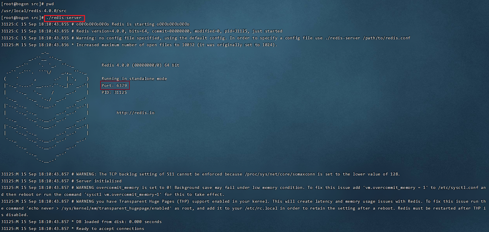

通过启动日志可以看到，Redis默认端口号为==6379==。

==Ctrl + C==停止Redis服务

通过==redis-cli==可以连接到本地的Redis服务，默认情况下不需要认证即可连接成功。

退出客户端可以输入==exit==或者==quit==命令。

**2）Windows系统中启动和停止Redis**

Windows系统中启动Redis，直接双击redis-server.exe即可启动Redis服务，redis服务默认端口号为6379


==Ctrl + C==停止Redis服务

双击==redis-cli.exe==即可启动Redis客户端，默认连接的是本地的Redis服务，而且不需要认证即可连接成功。

退出客户端可以输入==exit==或者==quit==命令。

### 2.4 Redis配置文件

前面我们已经启动了Redis服务，默认情况下Redis启动后是在前台运行，而且客户端不需要密码就可以连接到Redis服务。如果我们希望Redis服务启动后是在后台运行，同时希望客户端认证通过后才能连接到Redis服务，应该如果做呢？

此时就需要修改Redis的配置文件：

- Linux系统中Redis配置文件：REDIS_HOME/redis.conf
- Windows系统中Redis配置文件：REDIS_HOME/redis.windows.conf

**通过修改Redis配置文件可以进行如下配置：**

**1）**设置Redis服务后台运行

​	将配置文件中的==daemonize==配置项改为yes，默认值为no。

​	注意：Windows版的Redis不支持后台运行。

**2）**设置Redis服务密码

​	将配置文件中的 ==# requirepass foobared== 配置项取消注释，默认为注释状态。foobared为密码，可以根据情况自己指定。

​	访问redis时通过 -a 进行验证：redis-cli -a itheima   或者进入redis后 通过 auth itheima 验证

**3）**设置允许客户端远程连接Redis服务

​	Redis服务默认只能客户端本地连接，不允许客户端远程连接。将配置文件中的 ==bind 127.0.0.1== 配置项注释掉。

**解释说明：**

> Redis配置文件中 ==#== 表示注释
>
> Redis配置文件中的配置项前面不能有空格，需要顶格写
>
> daemonize：用来指定redis是否要用守护线程的方式启动，设置成yes时，代表开启守护进程模式。在该模式下，redis会在后台运行
>
> requirepass：设置Redis的连接密码,例如：requirepass 123456 密码就是123456
>
> bind：如果指定了bind，则说明只允许来自指定网卡的Redis请求。如果没有指定，就说明可以接受来自任意一个网卡的Redis请求。


**注意**：修改配置文件后需要重启Redis服务配置才能生效，并且启动Redis服务时需要显示的指定配置文件：

1）Linux中启动Redis服务

~~~shell
#可直接启动, 指定配置文件
redis-server redis.conf

# 也可以进入Redis安装目录下启动Redis服务, 指定配置文件
./src/redis-server ./redis.conf

#启动客户端
启动redis-cli后, auth 密码  或   redis-cli -a 密码
~~~

2）Windows中打开CMD ,带配置启动Redis服务.(双击redis-server默认是连本地的)


由于Redis配置文件中开启了认证校验，即客户端连接时需要提供密码，此时客户端连接方式变为：


或者双击redis-cli, auth+密码 连接客户端

**解释说明：**

> -h：指定连接的Redis服务的ip地址
>
> -p：指定连接的Redis服务的端口号
>
> -a：指定连接的Redis服务的密码

**在Linux中开放 Redis端口(6379)**

更多命令可以参考Redis中文网：https://www.redis.net.cn


# Kafka

目前提供虚拟机以及有kafka相关容器，先停止，再删除相关容器，计划新创建相关容器

1. 停止并删除相关容器：kafkadrop（Kafka图形化客户端）,kafka（消息中间件服务）,zookeeper（Kafka依赖的注册中心）

   ```dockerfile
   docker stop kafka1 hmtt_zookeeper_1
   docker rm kafka1 hmtt_zookeeper_1
   ```

2. 安装zookeeper容器

   ```dockerfile
   docker run -d --name zookeeper1 -v /etc/localtime:/etc/localtime --restart=always -p 2181:2181 zookeeper
   ```

3. 安装kafka容器

   ```dockerfile
   docker run  -d --name kafka1 --restart=always -p 9092:9092 -v /etc/localtime:/etc/localtime -e KAFKA_BROKER_ID=0 -e KAFKA_ZOOKEEPER_CONNECT=192.168.137.136:2181/kafka  -e KAFKA_ADVERTISED_LISTENERS=PLAINTEXT://192.168.137.136:9092 -e KAFKA_LISTENERS=PLAINTEXT://0.0.0.0:9092 -t wurstmeister/kafka
   ```

4. 安装kafkaDrop容器-管理平台 默认端口9000跟MinIO冲突，修改为9100

   ```dockerfile
   docker run  -d --name kafdrop1 --restart=always -p 9100:9000 -e KAFKA_BROKERCONNECT=192.168.137.136:9092 -e JVM_OPTS="-Xms32M -Xmx64M" -e SERVER_SERVLET_CONTEXTPATH="/" -t obsidiandynamics/kafdrop
   ```

5. 访问管理平台：http://192.168.137.136:9100

# PostgreSQL

```bash
必须要管理员运行CMD, 否则pg_ctl无法注册到服务管理器

//============= 进入到bin目录下
cd /d D:\ProgramFiles\PostgreSQL\15\bin\

//============= 注册服务
.\pg_ctl.exe register -N "postgresql-x64-15" -D "D:\ProgramFiles\PostgreSQL\15\data\"

//============= 打开services.msc 
右键postgresql服务属性->选择登录->本地系统账户 允许服务与桌面交互

//============= 初始化数据库
initdb.exe -D D:\ProgramFiles\PostgreSQL\15\data\

属于此数据库系统的文件宿主为用户 "think".
此用户也必须为服务器进程的宿主.
数据库簇将使用本地化语言 "Chinese (Simplified)_China.936"进行初始化.
本地化隐含的编码 "GBK" 不允许作为服务器端的编码.
默认的数据库编码将采用 "UTF8" 作为代替.
initdb: 无法为本地化语言环境"Chinese (Simplified)_China.936"找到合适的文本搜索配置
缺省的文本搜索配置将会被设置到"simple"

禁止为数据页生成校验和.

修复已存在目录 D:/ProgramFiles/PostgreSQL/15/data 的权限 ... 成功
正在创建子目录 ... 成功
选择动态共享内存实现 ......windows
选择默认最大联接数 (max_connections) ... 100
选择默认共享缓冲区大小 (shared_buffers) ... 128MB
选择默认时区 ... Asia/Shanghai
创建配置文件 ... 成功
正在运行自举脚本 ...成功
正在执行自举后初始化 ...成功
同步数据到磁盘...成功

initdb: 警告: 为本地连接启用"trust"身份验证
initdb: hint: You can change this by editing pg_hba.conf or using the option -A, or --auth-local and --auth-host, the next time you run initdb.

成功。您现在可以用下面的命令开启数据库服务器：

    pg_ctl -D ^"D^:^\ProgramFiles^\PostgreSQL^\15^\data^\^\^" -l 日志文件 start


// 开启服务
打开services.msc, 右键postgresql 开启服务

//============= 启动bin目录下启动postgresql, 用户名postgres可填入初始化的那个用户
psql.exe -U postgres


// 如果提示 致命错误:  角色 "postgres" 不存在, 则创建即可
bin目录下运行: createuser -s -r postgres

命令行出现 postgres=# 表示运行成功

// 本机密码: root/root


// ====================== pgAdmin 4的使用
打开pgadmin4, 密码就是安装时设置的密码(root), connection地址填入127.0.0.1, 数据库默认postgres , 账号填写初始化的用户名或者创建的postgres
```


# VMware中安装Linux

**1). 选择创建新的虚拟机**

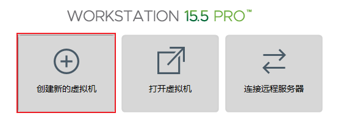 


**2). 选择"典型"配置**

 


**3). 选择"稍后安装操作系统(S)"**

 


**4). 选择"Linux"操作系统,"CentOS7 64位"版本**

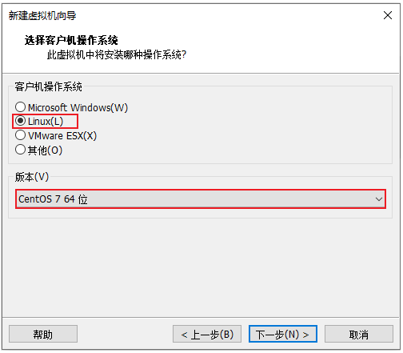 


**5). 设置虚拟机的名称及系统文件存放路径**

 


**6). 设置磁盘容量**

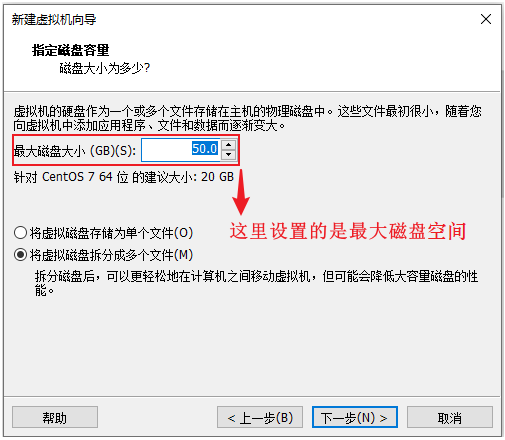 


**7). 自定义硬件信息**

 


**8). 启动上述创建的新虚拟机**

  


**9). 选择"Install CentOS7"**

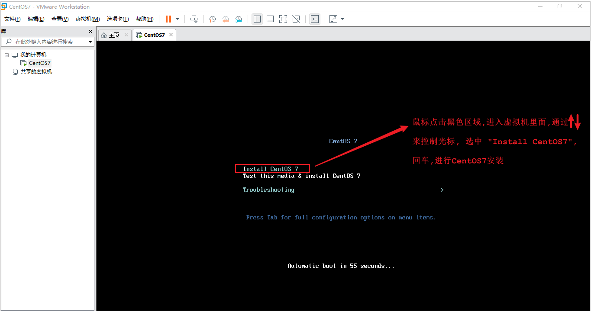 

> 进入到Linux系统里面, 我们发现光标无法移动到windows操作系统中了, 这个时候, 我们可以通过快捷键 "Ctrl+Alt" 切换光标到windows系统中。


**10). 选择语言为 "简体中文"**

 


**11). 选择"自动配置分区"**

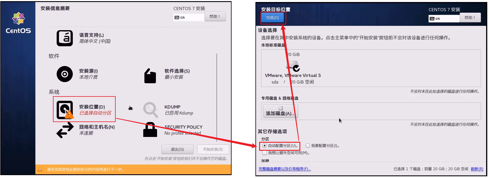  


12). 选择"最小安装"

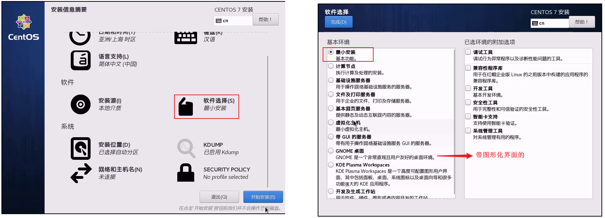 


**13). 设置"root"用户密码**

 

安装完毕后，点击窗口中的蓝色的 "重启" 按钮，重启Linux系统。


**14). 登录系统**

 

> 注意 : 在Linux系统中，在命令行中输入密码信息，为了保证安全性，密码是不显示的(看似没有输入，实际已经输入了)；

### 网卡设置 - 设置静态IP 

我们目前安装的Linux操作系统，安装完毕之后并没有配置IP地址，默认IP地址是动态获取的，那如果我们使用该Linux服务器部署项目，IP动态获取的话，也就意味着，IP地址可能会发生变动，那我们访问项目的话就会非常繁琐，所以作为服务器，我们一般还需要把IP地址设置为静态的。

**第一步：编辑网络信息**


**第二部：去掉DHCP，使用static IP**


> 去掉 2 位置的勾选

**第三步：查看网段，网关信息**


**第四步：配置网卡**

```shell
＃　进入到网卡配置目录
cd /etc/sysconfig/network-scripts/
```

查看网卡：

```shell
[root@localhost network-scripts]# ls
ifcfg-ens33  ifdown-ippp  ifdown-routes    ifup          ifup-ipv6   ifup-ppp       ifup-tunnel
ifcfg-lo     ifdown-ipv6  ifdown-sit       ifup-aliases  ifup-isdn   ifup-routes    ifup-wireless
```

编辑网卡(需要管理员账户)

```shell
vi ifcfg-ens33
```

按 i 进入编辑模式

```properties
TYPE=Ethernet
PROXY_METHOD=none
BROWSER_ONLY=no
BOOTPROTO=static	# 设置静态ip
DEFROUTE=yes
IPV4_FAILURE_FATAL=no
IPV6INIT=yes
IPV6_AUTOCONF=yes
IPV6_DEFROUTE=yes
IPV6_FAILURE_FATAL=no
IPV6_ADDR_GEN_MODE=stable-privacy
NAME=ens33
UUID=53716ac6-7c94-4290-a73a-a566402d585c
DEVICE=ens33
IPADDR=192.168.56.101   # 设置的静态IP地址, 倒数第二网段与网关保持一致, 最后网段在3~254范围内选
NETMASK=255.255.255.0	# 子网掩码
GATEWAY=192.168.56.2	# 网关 在NAT设置里查看,一定要相同
DNS1=114.114.114.114	# 域名解析的DNS, 全国通用DNS地址
DNS2=8.8.8.8		    # 域名解析的DNS, 全球通用DNS地址
ONBOOT=yes			    # 设置网卡开机启动
```

按 ESC , 在按 :wq  保存退出

**第五步：reboot 重启**  


验证是否能上网：有time表示可以上网

```shell
[root@localhost ~]# ping www.baidu.com
PING www.a.shifen.com (14.215.177.38) 56(84) bytes of data.
64 bytes from 14.215.177.38 (14.215.177.38): icmp_seq=1 ttl=128 time=43.9 ms
64 bytes from 14.215.177.38 (14.215.177.38): icmp_seq=2 ttl=128 time=42.6 ms
64 bytes from 14.215.177.38 (14.215.177.38): icmp_seq=3 ttl=128 time=42.8 ms
64 bytes from 14.215.177.38 (14.215.177.38): icmp_seq=4 ttl=128 time=42.8 ms
# 按 ctrl+c 结束
```


### 安装SSH连接工具

FinalShell


# Linux下软件安装与项目部署

## 1. 软件安装

### 1.1 软件安装方式

在Linux系统中，安装软件的方式主要有四种，这四种安装方式的特点如下：

| 安装方式         | 特点                                                         |
| ---------------- | ------------------------------------------------------------ |
| 二进制发布包安装 | 软件已经针对具体平台编译打包发布，==只要解压，修改配置即可== |
| rpm安装          | 软件已经按照redhat的包管理规范进行打包，使用==rpm命令进行安装==，`不能自行解决库依赖问题` |
| yum安装          | 一种`在线软件安装`方式，本质上还是rpm安装，`自动下载安装包并安装`，安装过程中自动解决库依赖问题(安装过程需要联网) |
| 源码编译安装     | 软件以`源码工程`的形式发布，需要自己`编译打包`               |


### 1.2 安装JDK

上述我们介绍了Linux系统软件安装的四种形式，接下来我们就通过第一种(二进制发布包)形式来安装JDK。

JDK具体安装步骤如下： 

1. 上传安装包到Linux
2. 解压安装包
3. 配置环境变量
4. 刷新环境变量配置
5. 验证

#### 1). 上传安装包

使用FinalShell自带的上传工具将jdk的二进制发布包上传到Linux

 

由于上述在进行文件上传时，选择的上传目录为根目录 /，上传完毕后，我们执行指令 cd / 切换到根目录下，查看上传的安装包。

 


#### 2). 解压安装包

执行如下指令，将上传上来的压缩包进行解压，并通过-C参数指定解压文件存放目录为 /usr/local。

```shell
tar -zxvf jdk-8u171-linux-x64.tar.gz -C /usr/local
```

 


#### 3). 配置环境变量

使用vim命令修改 /etc/profile文件，定位到文件末尾加入如下配置

```shell
export JAVA_HOME=/usr/local/jdk1.8.0_171
export PATH=$JAVA_HOME/bin:$PATH
```

- export的作用就是设置或者显示环境变量

具体操作指令如下: 

```shell
1). 编辑/etc/profile文件，进入命令模式
	vim /etc/profile

2). 在命令模式中，输入指令 G ， 切换到文件最后
	G

3). 在命令模式中输入 i/a/o 进入插入模式，然后切换到文件最后一行
	o

4). 将上述的配置拷贝到文件中
	export JAVA_HOME=/usr/local/jdk1.8.0_171
	export PATH=$JAVA_HOME/bin:$PATH
	
5). 从插入模式，切换到指令模式
	ESC
	
6). 按:进入底行模式，然后输入wq，回车保存
	:wq
```


#### 4). 重新加载profile文件

为了使更改的配置立即生效，需要重新加载profile文件，执行命令:

```shell
source /etc/profile
```


#### 5). 检查安装是否成功

```
java -version
```

 


### 1.3 安装Tomcat

#### 1.3.1 Tomcat安装

Tomcat的安装和上述JDK的安装采用相同的方式，都是使用二进制发布包的形式进行安装

**1). 上传安装包**

使用FinalShell自带的上传工具将Tomcat的二进制发布包上传到Linux(与前面上传JDK安装包步骤一致)。

 

**2). 解压安装包**

将上传上来的安装包解压到指定目录/usr/local下，执行命令为

```shell
tar -zxvf apache-tomcat-7.0.57.tar.gz -C /usr/local
```

**3). 启动Tomcat**

进入Tomcat的bin目录启动服务。执行命令为: 

```shell
cd /usr/local/apache-tomcat-7.0.57/
cd bin
sh startup.sh 或 ./startup.sh
```

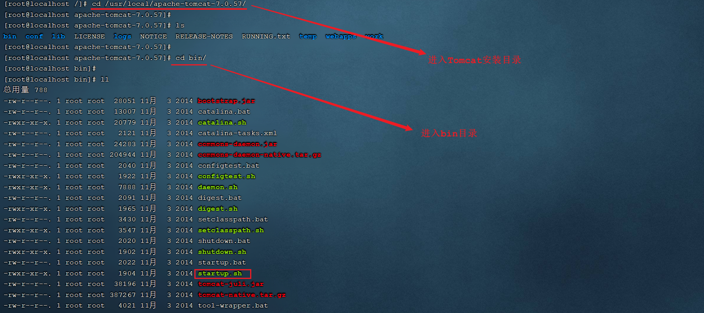 

 


#### 1.3.2 Tomcat进程查看

上述我们将Tomcat启动完成之后，并不能知道Tomcat是否正常运行，那么我们验证Tomcat启动是否成功，有多种方式，我们这里主要介绍常见的两种方式： 

**1). 查看启动日志**

Tomcat的启动日志输出在Tomcat的安装目录下的logs目录中，Tomcat的启动及运行日志文件名为 catalina.out，所以我们查看Tomcat启动日志，主要可以通过两条指令，如下： 

```shell
1). 分页查询Tomcat的日志信息
more /usr/local/apache-tomcat-7.0.57/logs/catalina.out

2). 查询日志文件尾部的50行记录
tail -50 /usr/local/apache-tomcat-7.0.57/logs/catalina.out
```

只要Tomcat在启动的过程中，日志输出没有报错，基本可以判定Tomcat启动成功了。


**2). 查询系统进程**

我们也可以通过Linux系统的查看系统进程的指令，来判定Tomcat进程是否存在，从而判定Tomcat是否启动。执行如下指令： 

```shell
ps -ef|grep tomcat
```

 

**说明:** 

- ==ps==命令是linux下非常强大的进程查看命令，通过ps -ef可以查看当前运行的所有进程的详细信息
  - -e：显示系统内的所有进程信息
  - -f：使用完整的(full)格式显示进程信息
- =="|"== 在Linux中称为管道符，可以将前一个命令的结果输出给后一个命令作为输入
- 使用ps命令查看进程时，经常配合管道符和查找命令 grep 一起使用，来查看特定进程


#### 1.3.3 防火墙操作

前面我们已经通过日志的方式及查看系统进程的方式，验证了Tomcat服务已经正常启动，接下来我们就可以尝试访问一下。访问地址：http://192.168.138.130:8080，我们发现是访问不到的。 

那为什么tomcat启动成功了，但就是访问不到呢？原因就在于Linux系统的防火墙，系统安装完毕后，系统启动时，防火墙自动启动，防火墙拦截了所有端口的访问。接下来我们就需要学习一下，如何操作防火墙，具体指令如下： 

| 操作                         | 指令                                              | 备注                 |
| ---------------------------- | ------------------------------------------------- | -------------------- |
| 查看防火墙状态               | systemctl status firewalld / firewall-cmd --state |                      |
| 暂时关闭防火墙               | systemctl stop firewalld                          |                      |
| 暂时开启防火墙               | systemctl start firewalld                         |                      |
| 永久关闭防火墙(禁用开机自启) | systemctl disable firewalld                       | ==下次启动,才生效==  |
| 永久开启防火墙(启用开机自启) | systemctl enable firewalld                        | ==下次启动,才生效==  |
| 开放指定端口                 | firewall-cmd --add-port=8080/tcp --permanent      | ==需要重新加载生效== |
| 关闭指定端口                 | firewall-cmd --remove-port=8080/tcp --permanent   | ==需要重新加载生效== |
| 立即生效(重新加载)           | firewall-cmd --reload                             |                      |
| 查看开放端口                 | firewall-cmd --list-ports                         |                      |

> 注意：
>
> ​	A. systemctl是管理Linux中服务的命令，可以对服务进行启动、停止、重启、查看状态等操作
>
> ​	B. firewall-cmd是Linux中专门用于控制防火墙的命令
>
> ​	C. 为了保证系统安全，服务器的防火墙不建议关闭

那么我们要想访问到Tomcat，就可以采取两种类型的操作：

**A. 关闭防火墙**

执行指令 : 

```shell
systemctl stop firewalld
```

关闭之后，再次访问Tomcat，就可以访问到了。 

<font color='red'>注意: 上面我们也提到了，直接关闭系统的防火墙，是不建议的，因为这样会造成系统不安全。</font>

**B. 开放Tomcat的端口号8080**

执行指令: 

```shell
①. 先开启系统防火墙
systemctl start firewalld

②. 再开放8080端口号
firewall-cmd --add-port=8080/tcp --permanent

③. 重新加载防火墙
firewall-cmd --reload
```

执行上述的操作之后，就开放了当前系统中的8080端口号，再次访问Tomcat。

#### 1.3.4 停止Tomcat

在Linux系统中，停止Tomcat服务的方式主要有两种： 

**1). 运行Tomcat提供的脚本文件**

在Tomcat安装目录下有一个bin目录，这个目录中存放的是tomcat的运行脚本文件，其中有一个脚本就是用于停止tomcat服务的。

 

我们可以切换到bin目录，并执行如下指令，来停止Tomcat服务：

```shell
sh shutdown.sh
./shutdown.sh
```


**2). 结束Tomcat进程**

我们可以先通过 `ps -ef|grep tomcat` 指令查看tomcat进程的信息，从进程信息中获取tomcat服务的进程号。然后通过kill -9 的形式，来杀死系统进程。

 

通过上述的指令，我们可以获取到tomcat的进程号为 79947。接下来，我们就可以通过指令 ，来杀死tomcat的进程 ：

```
kill -9 79947 
```

执行完上述指令之后，我们再访问Linux系统中的Tomcat，就访问不到了。

> 注意：
>
> ​	kill命令是Linux提供的用于结束进程的命令，-9表示强制结束

> 注意 ： 
>
> ​	虽然上述讲解的两种方式，都可以停止Tomcat服务，但是推荐使用第一种方式(./shutdown.sh)执行脚本来关闭tomcat服务，如果通过第一种方式停止不了tomcat了，这个时候，我们可以考虑使用第二种方式，强制杀死进程。


### 1.4 安装MySQL

#### 1.4.1 MySQL安装

对于MySQL数据库的安装，我们将要使用前面讲解的第二种安装方式rpm进行安装。那么首先我们先了解一下什么rpm？

> **RPM：**全称为 Red-Hat Package Manager，RPM软件包管理器，是红帽Linux贡献出来的，用于管理和安装软件的工具。

我们要通过rpm，进行MySQL数据库的安装，主要的步骤如下：

**1). 检测当前系统是否安装过MySQL相关数据库**

需要通过rpm相关指令，来查询当前系统中是否存在已安装的mysql软件包，执行指令如下：

```shell
rpm –qa							查询当前系统中安装的所有软件
rpm –qa | grep mysql			查询当前系统中安装的名称带mysql的软件
rpm –qa | grep mariadb			查询当前系统中安装的名称带mariadb的软件
```

- -q: query 查询
- -a: all 全部

通过rpm -qa 查询到系统通过rpm安装的所有软件，太多了，不方便查看，所以我们可以通过管道符 | 配合着grep进行过滤查询。

 

通过查询，我们发现在当前系统中存在mariadb数据库，是CentOS7中自带的，而这个数据库和MySQL数据库是冲突的，所以要想保证MySQL成功安装，需要卸载mariadb数据库。


**2). 卸载现有的MySQL数据库**

在rpm中，卸载软件的语法为： 

```shell
rpm -e --nodeps  软件名称    #--nodeps 不检查依赖
```

那么，我们就可以通过指令，卸载 mariadb，具体指令为： 

```shell
rpm -e --nodeps  mariadb-libs-5.5.60-1.el7_5.x86_64
```

 

我们看到执行完毕之后， 再次查询 mariadb，就查不到了，因为已经被成功卸载了。


**3). 将MySQL安装包上传到Linux并解压**

A. 上传MySQL安装包

 

B. 解压到/usr/local/mysql, 执行如下指令: 

```shell
mkdir /usr/local/mysql
tar -zxvf mysql-5.7.25-1.el7.x86_64.rpm-bundle.tar.gz -C /usr/local/mysql
```

 


**4). 顺序安装rpm安装包**

```shell
rpm -ivh mysql-community-common-5.7.25-1.el7.x86_64.rpm
rpm -ivh mysql-community-libs-5.7.25-1.el7.x86_64.rpm
rpm -ivh mysql-community-devel-5.7.25-1.el7.x86_64.rpm
rpm -ivh mysql-community-libs-compat-5.7.25-1.el7.x86_64.rpm
rpm -ivh mysql-community-client-5.7.25-1.el7.x86_64.rpm
yum -y install net-tools
rpm -ivh mysql-community-server-5.7.25-1.el7.x86_64.rpm
```

- -i: install 安装
- -v: verbose 显示安装的详细信息
- -h: 用#显示安装进度条

> 说明: 
>
> - 因为rpm安装方式，是不会自动处理依赖关系的，需要我们自己处理，所以对于上面的rpm包的安装顺序不能随意修改。
> - 安装过程中提示缺少net-tools依赖，使用yum安装(yum是一种在线安装方式，需要保证联网)
> - 可以通过指令(yum update)升级现有软件及系统内核

 


#### 1.4.2 MySQL启动

MySQL安装完成之后，会自动注册为系统的服务，服务名为mysqld。那么，我们就可以通过systemctl指令来查看mysql的状态、启动mysql、停止mysql。

```shell
systemctl status mysqld		查看mysql服务状态
systemctl start mysqld		启动mysql服务
systemctl stop mysqld		停止mysql服务
```


> 说明： 
>
> ​	可以设置开机时启动mysql服务，避免每次开机启动mysql。执行如下指令： 
>
> ​	systemctl enable mysqld

我们可以通过如下两种方式，来判定mysql是否启动：

```shell
netstat -tunlp					查看已经启动的服务
netstat -tunlp | grep mysql		查看mysql的服务信息

ps –ef | grep mysql				查看mysql进程
```

 

> <font color='red'>备注: </font>
>
> ​	<font color='red'>A. netstat命令用来打印Linux中网络系统的状态信息，可让你得知整个Linux系统的网络情况。</font>
>
> ​		参数说明: 
>
> ​		-l或--listening：显示监控中的服务器的Socket；
> ​		-n或--numeric：直接使用ip地址，而不通过域名服务器；
> ​		-p或--programs：显示正在使用Socket的程序识别码和程序名称；
> ​		-t或--tcp：显示TCP传输协议的连线状况；
> ​		-u或--udp：显示UDP传输协议的连线状况；
>
> ​	<font color='red'>B. ps命令用于查看Linux中的进程数据。</font>


#### 1.4.3 MySQL登录

##### 1.4.3.1 查阅临时密码

MySQL启动起来之后，我们就可以测试一下登录操作，但是我们要想登录MySQL，需要一个访问密码，而刚才在安装MySQL的过程中，并没有看到让我们设置访问密码，那这个访问密码是多少呢? 那实际上，对于rpm安装的mysql，在mysql第一次启动时，会自动帮我们生成root用户的访问密码，并且输出在mysql的日志文件 /var/log/mysqld.log中，我们可以查看这份日志文件，从而获取到访问密码。


可以执行如下指令：

1). cat /var/log/mysqld.log

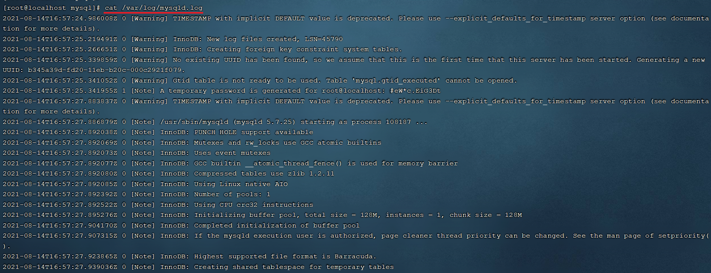 

这种方式，可以看到所有的日志数据，文件比较大时，很不方便查看数据。我们可以通过管道符 | 配合grep来对数据进行过滤。


2). cat /var/log/mysqld.log | grep password

我们可以通过上述指令，查询日志文件内容中包含password的行信息。

 


##### 1.4.3.2 登录MySQL

获取到root用户的临时密码之后，我们就可以登录mysql数据库，修改root的密码，为root设置一个新的密码。并且我们还需要开启root用户远程访问该数据库的权限，这样的话，我们就可以在windows上来访问这台MySQL数据库。

执行如下指令： 

```shell
①. 登录mysql（复制日志中的临时密码登录）
	mysql -uroot -p								

#mysql>的命令需要以 ;分号 结尾
②. 修改密码
    set global validate_password_length=4;		设置密码长度最低位数，默认最低要求长度是8位
    set global validate_password_policy=LOW;	设置密码安全等级低，便于密码可以修改成root
    set password = password('root');			设置密码为root
    
③. 开启访问权限 ,注意密码是上面修改的密码
    grant all on *.* to 'root'@'%' identified by 'root';
    flush privileges;
```

操作完上述的指令之后，数据库root用户的密码以及远程访问我们就配置好了，接下来，可以执行exit退出mysql，再次通过新的密码进行登录。

 

当然我们也可以使用安装在windows系统中的sqlyog或者Navicat来远程连接linux上的MySQL。

==注意： 要想在windows上能够访问MySQL，还需要开放防火墙的3306端口，执行如下指令：==

```shell
firewall-cmd --add-port=3306/tcp --permanent
firewall-cmd --reload
```


### 1.5 安装lrzsz

lrzsz 是用于在Linux系统中文件上传下载的软件。

大家可能会存在疑问，我们用finalShell图形化界面就可以很方便的完成上传下载，为什么还要使用这个软件来完成上传下载呢？实际上是这样的，Linux的远程连接工具有很多，而finalShell只是其中的一种，而还有很多的远程连接工具并没有上传下载的功能，这个时候就需要依赖于lrzsz这个软件了。

对于lrzsz的安装，我们需要通过第三种软件安装方式yum来进行安装。这里，我们先对yum做一个简单介绍。

> **Yum：** (Yellow dog Updater,Modified)，是一个在Fedora和RedHat以及CentOS中的Shell前端软件包管理器。基于RPM包管理，能够从指定的服务器自动下载RPM包并且安装，可以自动处理依赖关系，并且一次安装所有依赖的软件包，无须繁琐地一次次下载、安装。
>
> 就好像 Windows 系统上可以通过 360 软件管家实现软件的一键安装、升级和卸载，Linux 系统也提供有这样的工具，就是 yum。


安装lrzsz的步骤如下: 

**1). 搜索lrzsz安装包**

```
yum list lrzsz
```

 

**2). 在线安装lrzsz**

```
yum -y install lrzsz.x86_64
```

 

**3). 测试**

在命令行中输入 rz , 就会自动打开一个文件选择的窗口，然后选择要上传的文件。

 


> **yum拓展知识:**
>
> ​	 1). 如果在不更改软件来源的情况下，是需要联网才能使用yum的，那么我们安装的软件是从哪儿下载的呢，这里就涉及到一个概念： yum源。
>
> ​	 2). 我们可以通过一个指令，来检查当前的yum源
>
> ​		   
>
> ​		从图中，我们可以看到我们安装的 CentOS7 采用的是网易的163yum源。
>
> ​		
>
> ​	  3). 网络 yum 源配置文件位于 /etc/yum.repos.d/ 目录下，文件扩展名为"*.repo"
>
> ​		 
>
> ​		可以看到，该目录下有 7 个 yum 配置文件，通常情况下 CentOS-Base.repo 文件生效。
>
> ​		
>
> ​	  4). 添加阿里云yum源
>
> ​		官网：https://developer.aliyun.com/mirror/centos?spm=a2c6h.13651102.0.0.94b41b11xg8HbL
>
> ​		A. 先通过 `yum install wget` ,安装wget命令
>
> ​		B. 备份默认的yum源，执行指令 ：
>
> ​		   mv /etc/yum.repos.d/CentOS-Base.repo /etc/yum.repos.d/CentOS-Base.repo.backup
>
> ​		C. 下载阿里云的yum源，注意不要用https ，用 http 否则需要设置域名解析
>
> ​           wget -O /etc/yum.repos.d/CentOS-Base.repo http://mirrors.aliyun.com/repo/Centos-7.repo
>
> ​		D. 执行命令，重新生成cache			
>
> ​			yum clean all
>
> ​			yum makecache
>
> ​		E. 再次查看yum源
>
> ​			 
>
> ​			之后，我们通过yum指令安装软件，就是从阿里云下载的。

```shell
#如果使用https, 需要设置域名解析
# vi /etc/resolv.conf
 
# Generated by NetworkManager
nameserver 8.8.8.8
nameserver 114.114.114.114
```


## 2. 项目部署

将来我们开发的项目都需要部署在Linux系统中。那么在本章节，我们将通过两种方式，来演示项目部署

- 手动部署项目
- 基于shell脚本自动部署。

### 2.1 手动部署项目

**1). 在IDEA中开发SpringBoot项目并打成jar包**

演示: 准备一个简单的springboot项目，可以在本地的idea中先启动当前的demo工程，然后访问一下，看看工程是否正常访问。 执行package指令，进行打包操作，将当前的springboot项目，打成一个jar包。  

**2). 将jar包上传到Linux服务器**

通过 rz 指令，将打好的jar包上传至Linux服务器的 /usr/local/app 目录下。 先执行指令创建app目录。

```shell
A. 在/usr/local下创建目录app
mkdir /usr/local/app

B. 切换到app目录下
cd /usr/local/app

C. 执行指令,进行jar包上传
rz 
```

此时这个jar包就上传到 /usr/local/app 目录了。 


**3). 启动SpringBoot程序**

由于我们的项目已经打成jar包上传上来到Linux服务器，我们只需要运行这个jar包项目就启动起来了，所以只需要执行如下指令即可： 

```shell
java -jar helloworld-1.0-SNAPSHOT.jar
```

==注意： 由于前面安装的Tomcat在启动时，会占用端口号8080，而当前springboot项目我们没有配置端口号，默认也是8080，所以我们要想启动springboot项目，需要把之前运行的Tomcat停止掉。==


**4). 检查防火墙，确保8080端口对外开放，访问SpringBoot项目**

```shell
firewall-cmd  --list-ports
```

 

如果防火墙没有放开8080端口，还需要放开对应的端口号，执行如下指令：

```shell
firewall-cmd  --add-port=8080/tcp --permanent
firewall-cmd --reload
```

 

**6). 后台运行项目**

当前这个demo工程我们已经部署成功了，并且我们也可以访问项目了。但是这个工程目前是存在问题的，就是当前我们项目启动的这个窗口被霸屏占用了，如果我们把这个窗口关闭掉(或ctrl+c)，当前服务也就访问不到了，我们可以试一下。

**目前程序运行的问题：**

A. 线上程序不会采用控制台霸屏的形式运行程序，而是将程序在后台运行

B. 线上程序不会将日志输出到控制台，而是输出到日志文件，方便运维查阅信息

**后台运行程序:**

要想让我们部署的项目进行后台运行，这个时候我们需要使用到linux中的一个命令 nohup ，接下来，就来介绍一下nohup命令。

> **nohup命令：**英文全称 no hang up（不挂起），用于不挂断地运行指定命令，退出终端不会影响程序的运行
>
> **语法格式：** nohup Command [ Arg … ] [&]
>
> **参数说明：**
>
> ​	Command：要执行的命令
>
> ​	Arg：一些参数，可以指定输出文件
>
> ​	&：让命令在后台运行
>
> **举例：**
>
> ​	nohup java -jar boot工程.jar &> hello.log &
>
> ​	上述指令的含义为： 后台运行 java -jar 命令，并将日志输出到hello.log文件，注意第一个&符号后面不用加空格


那么经过上面的介绍，我们可以推测中，我们要想让当前部署的项目后台运行，就可以使用下面的指令： 

```shell
nohup java -jar helloworld-1.0-SNAPSHOT.jar &> hello.log & 
```

这样的话，我们的项目就已经启动成功了，我们可以通过ps指令，查看到系统的进程。 

**7). 停止SpringBoot项目**

 


### 2.2 基于Shell脚本自动部署

#### 2.2.1 介绍

前面介绍的项目部署是手动部署，也就是部署过程中的每一步操作都需要我们手动操作。接下来，我们需要再讲解一下项目的自动部署，从而来简化项目部署的操作，那么我们先来整体上了解一下项目自动部署的流程及操作步骤。 

操作步骤如下： 

1). 在Gitee上创建远程仓库，并将本地的项目代码推送到远程仓库中

2). 在Linux中安装Git,克隆代码

3). 在Linux中安装maven

4). 编写Shell脚本（拉取代码、编译、打包、启动）

5). 为用户授予执行Shell脚本的权限

6). 执行Shell脚本


#### 2.2.2 推送代码到远程

这部分操作，大家只需要参考之前讲解的Git，来完成helloworld工程代码推送即可。

A. 创建远程仓库 

B. 将idea中的代码提交并推送到远程仓库  

> 如果是本地初始化的仓库，第一次在pull的时候需要通过终端操作
>
> git pull origin master --allow-unrelated-histories

#### 2.2.3 Git操作

1). Git软件安装

通过yum命令在线安装git，执行如下指令： 

```shell
yum list git			列出git安装包
yum -y install git		在线安装git
```

通过上述指令，安装好git之后，我们就可以通过 git --version去验证git的环境。   

2). Git克隆代码

```shell
cd /usr/local/
# 克隆方式1.用 SSH 连接clone的项目, 是免秘钥的(需要先部署公钥管理)
git clone git@gitee.com:venn553/reggie-parent.git

# 克隆方式2.用 HTTPS 连接需要每次输入git账号密码
git clone https://gitee.com/ChuanZhiBoKe/helloworld.git
```

 

#### 2.2.4 Maven安装

由于我们的工程是maven工程，我们要想进行项目的编译打包，需要用到maven的指令，所以需要安装maven。具体操作步骤如下：

**1). 上传资料中提供的maven的安装包**

通过rz指令上传课程资料中的maven安装包 

 

 

**2). 解压maven安装包到/usr/local目录**

```shell
tar -zxvf apache-maven-3.5.4-bin.tar.gz -C /usr/local
```

**3). 在/etc/profile配置文件中配置环境变量**

```shell
vim /etc/profile

修改配置文件，进入到命令模式，按G切换到最后一行，按a/i/o进入插入模式，然后在最后加入如下内容 :
export MAVEN_HOME=/usr/local/apache-maven-3.5.4
export PATH=$JAVA_HOME/bin:$MAVEN_HOME/bin:$PATH

然后按ESC进入到命令模式，输入 :wq 保存并退出
```

 


要想让配置的环境变量生效,还需要执行如下指令:

```shell
source /etc/profile
```

 

**4). 修改maven的settings.xml配置文件,配置本地仓库地址**

A. 切换目录

```shell
cd /usr/local/apache-maven-3.5.4/conf
```

B. 编辑settings.xml配置文件

```shell
vim settings.xml
```

在其中增加如下配置,配置本地仓库地址:

```xml
<localRepository>/usr/local/repo</localRepository>
```

 


并在settings.xml中的<mirrors>标签中,配置阿里云的私服(==选做==):

```xml
<mirror> 
    <id>alimaven</id> 
    <mirrorOf>central</mirrorOf> 
    <name>aliyun maven</name> 
    <url>http://maven.aliyun.com/nexus/content/groups/public/</url>
</mirror> 
```

 


#### 2.2.5 Shell脚本准备

> Shell脚本（shell script），是一种Linux系统中的脚本程序。使用Shell脚本编程跟 JavaScript、Java编程一样，只要有一个能编写代码的文本编辑器和一个能解释执行的脚本解释器就可以了。 
>
> 对于Shell脚本编写不作为本课程重点内容，直接使用课程资料中提供的脚本文件bootStart.sh即可。

上传【资料】中提供 bootStart.sh 到 /usr/local 目录

**脚本解读:** 

```sh
#!/bin/sh
echo =================================
echo  自动化部署脚本启动
echo =================================

echo 停止原来运行中的工程
APP_NAME=ReggieManageApplication

tpid=`ps -ef|grep $APP_NAME|grep -v grep|grep -v kill|awk '{print $2}'`
if [ ${tpid} ]; then
    echo 'Stop Process...'
    kill -15 $tpid
fi
sleep 2
tpid=`ps -ef|grep $APP_NAME|grep -v grep|grep -v kill|awk '{print $2}'`
if [ ${tpid} ]; then
    echo 'Kill Process!'
    kill -9 $tpid
else
    echo 'Stop Success!'
fi

echo 准备从Git仓库拉取最新代码
cd /usr/local/app-LYY/reggie-parent  #本地仓库位置

echo 开始从Git仓库拉取最新代码
git pull
echo 代码拉取完成

echo 开始打包
output=`mvn clean package -Dmaven.test.skip=true`

cd reggie-web-manage/target    # 需要启动的jar 打包生成的位置

echo 启动项目
nohup java -jar reggie-web-manage-1.0-SNAPSHOT.jar &> reggie.log &
echo 项目启动完成
```


 

```
kill 信号值15可以在结束此进程之前，允许此进程做一些清理工作(clean-up)
     信号值9会直接杀死目标进程，不给其机会做清理工作
```

**脚本授权**

```shell
chmod 755 bootStart.sh
```

#### 访问测试：

执行脚本部署项目

```shell
./bootStart.sh
```

本地访问测试：

http://192.168.56.101:8080/hello


### 2.2.6 Linux权限

前面我们已经把Shell脚本准备好了，但是Shell脚本要想正常的执行，还需要给Shell脚本分配执行权限。 由于linux系统是一个多用户的操作系统，并且针对每一个用户，Linux会严格的控制操作权限。接下来，我们就需要介绍一下Linux系统的权限控制。

> 1). ==chmod==（英文全拼：change mode）命令是控制用户对文件的权限的命令
>
> 2). Linux中的权限分为三种 ：读(r)、写(w)、执行(x)
>
> 3). Linux文件权限分为三级 : 文件所有者（Owner）、用户组（Group）、其它用户（Other Users）
>
> 4). 只有文件的所有者和超级用户可以修改文件或目录的权限
>
> 5). 要执行Shell脚本需要有对此脚本文件的执行权限(x)，如果没有则不能执行


Linux系统中权限描述如下: 

 


解析当前脚本的权限情况: 

 


chmod命令可以使用八进制数来指定权限(0 - 代表无 , 1 - 执行x , 2 - 写w , 4 - 读r):

| 值   | 权限           | rwx  |
| ---- | -------------- | ---- |
| 7    | 读 + 写 + 执行 | rwx  |
| 6    | 读 + 写        | rw-  |
| 5    | 读 + 执行      | r-x  |
| 4    | 只读           | r--  |
| 3    | 写 + 执行      | -wx  |
| 2    | 只写           | -w-  |
| 1    | 只执行         | --x  |
| 0    | 无             | ---  |


**举例:**

```shell
# 数字方式授权
chmod 777 bootStart.sh   为所有用户授予读、写、执行权限
chmod 755 bootStart.sh   为文件拥有者授予读、写、执行权限，同组用户和其他用户授予读、执行权限
chmod 210 bootStart.sh   为文件拥有者授予写权限，同组用户授予执行权限，其他用户没有任何权限
```

```shell
# 字母方式授权
chmod ug=rwx,o=r bootStart.sh  为文件 拥有者(u) 和 组(g) 授予读写执行权限，其他人() 只有读权限
chmod g-x,o+w 	 bootStart.sh  为文件所属组去除执行权限，其他人添加写权限
```

==注意:==

三个数字分别代表不同用户的权限

- 第1位表示文件拥有者的权限
- 第2位表示同组用户的权限
- 第3位表示其他用户的权限


### Git免密钥访问

**第一步：**本地创建公钥

```shell
ssh-keygen -t ed25519 -C "hello@itheima.com"  
```

按照提示完成三次回车，即可生成 ssh key


**第二步：**查看公钥

cat ~/.ssh/id_ed25519.pub

```shell
[root@localhost local]# cat ~/.ssh/id_ed25519.pub
ssh-ed25519 AAAAC3NzaC1lZDI1NTE5AAAAICK+XjnONXTu2zHZzz2iguKElxKs6ohEiv+Nb+1hOBnz hello@itheima.com
```


**第三步：**配置公钥

gitee 找到自己的项目，点击管理


添加公钥


```shell
#测试秘钥, 输入yes, 显示Hi Anonymous! You've successfully authenticated表示成功
ssh -T git@gitee.com
```


**第四步：**https 切换到ssl 协议 【可选】

如果之前是==通过 https 协议clone的项目==，需要修改成ssl协议才能实现免密访问

```shell
# 进入本地仓库目录, 设置克隆协议
git remote set-url origin git@gitee.com:venn553/reggie-parent.git

#查看克隆协议
git remote -v
```


### 总结


#### Linux软件安装

- *.tar.gz 压塑包如何安装： 例如jdk  tomcat

```shell
1. 解压包
tar -zxvf 软件包 -C 解压路径
tar -zcvf 包名  文件...
2. 配置（环境变量配置、配置文件）
```

- *.rpm 软件包的安装

```shell
rpm -ivh 软件包
```

- 在线安装： yum

```shell
yum -y install 软件名
```

小知识点：

1. 查看进程是否启动： ps -ef|grep tomcat
2. 查看网络信息：netstat -tunlp | grep tomcat
3. 结束进程：kill -9 进程ID
4. 后台运行进程： nohup 命令  &
   1. nohup java -jar  helloworld.jar &  默认把日志输出nohup.out
   2. nohup java -jar  helloworld.jar &> hello.log & 手动指定日志文件名称
5. 防火墙：
   - 开启： systemctl start firewalld
   - 关闭： systemctl stop firewalld
   - 查看状态：status
   - 开启端口：firewall-cmd -add-port=8080/tcp --permanent 
     - firewall-cmd -add-port=3306/tcp --permanent  允许3306端口的请求通过防火墙
   - 重新加载防火墙规则：firewall-cmd --reload

6. Linux文件权限
   1. 文件权限又3部分组成：所属用户 用户所属组 其他人
   2. 文件授权2中方式
      1. 字母方式授权： chmod u=rwx,g+rx,o-wx  aa.sh
      2. 数字方式授权： chmod 754 aa.sh

#### 项目部署

1. 手动部署

- 本地package 打包
- 上传jar包
- java -jar xxx.jar  (后台执行: nohup java -jar  xxx.jar &> xxx.log &)

2. shell脚本部署

- 用 yum 安装软件 - git
- 用 tar.gz 压缩包安装 -  maven
- 更改shell脚本权限 chmod 755 xxx.sh
- ./xxx.sh 执行脚本自动部署项目

安装完LINUX后经常使用终端远程登录，登录后经常出现”You have new mail in /var/spool/mail/root”的提示，这东西到底是做什么用的呢？经过查询才知道这是LINUX的邮件提示功能。LINUX会定时查看系统各种状态做汇总，每经过一段时间会把汇总的信息发送的root的邮箱里。

禁止系统检查邮件

```shell
echo "unset MAILCHECK" >> /etc/profile
source /etc/profile
```


# Nginx

nginx 是一个开源的 `HTTP` 和 `反向代理`服务器，也是一个通用的`TCP/UDP代理`服务器，是由伊戈尔·赛索耶夫(俄罗斯人)使用`C语言`编写的

- HTTP服务器功能：缓存静态文件、负载均衡...
- 反向代理：服务器的代理，帮助服务器做负载均衡，安全防护等。后续会详细解释
- 邮件代理：邮件服务器，收发邮件

官网：https://nginx.org/en/

#### 下载

在Nginx的官网的下载页面中(http://nginx.org/en/download.html)，就展示了当前Nginx版本，并提供了下载的连接。 

在本项目中，我们所学习的Nginx选择的是稳定版本的1.16这个版本，我们可以直接从官网`点击下载`，或者右键-复制链接地址，在Linux中使用 `wget命令下载` 

####  安装

**1). 安装依赖包**

由于nginx是基于c语言开发的，所以需要安装c语言的编译环境，及正则表达式库等第三方依赖库。

```
[root@localhost ~]# yum -y install gcc pcre-devel zlib-devel openssl openssl-devel
```

**2). 下载Nginx安装包**

```
[root@localhost ~]# yum -y install wget
[root@localhost ~]# cd /opt/
[root@localhost opt]# wget https://nginx.org/download/nginx-1.16.1.tar.gz
```

> wget : 
>
> ​	wget命令用来从指定的URL下载文件。wget非常稳定，它在带宽很窄的情况下和不稳定网络中有很强的适应性，如果是由于网络的原因下载失败，wget会不断的尝试，直到整个文件下载完毕。如果是服务器打断下载过程，它会再次联到服务器上从停止的地方继续下载。

**3). 解压nginx到当前opt目录**

```
[root@localhost opt]# tar -zxvf nginx-1.16.1.tar.gz
```

**4). 配置Nginx编译环境**

```
[root@localhost opt]# cd nginx-1.16.1/
[root@localhost nginx-1.16.1]# ./configure --prefix=/usr/local/nginx
```

`./configure` 来对编译参数进行设置，采用默认参数即可

--prefix: 编译参数，指定Nginx的安装目录。默认设置为/usr/local/nginx目录。

**5). 编译 安装**

```
[root@localhost nginx-1.16.1]# make 
[root@localhost nginx-1.16.1]# make install
```


### 目录结构

安装完Nginx后，我们可以切换到Nginx的安装目录(/usr/local/nginx)，先来熟悉一下Nginx的目录结构，如下图：

 

> 备注： 
>
> ​	上述我们用到的一个指令 tree，该指令可以将我们指定的目录以树状结构展示出来。如果没有这个指令，可以通过以下指令进行安装。
>
> ​	yum install -y tree


重点目录和文件如下: 

| 目录/文件       | 说明                                | 备注                                                      |
| --------------- | ----------------------------------- | --------------------------------------------------------- |
| conf            | 配置文件的存放目录                  |                                                           |
| conf/nginx.conf | Nginx的核心配置文件                 | conf下有很多nginx的配置文件，我们主要操作这个核心配置文件 |
| html            | 存放静态资源(html, css, )           | 部署到Nginx的静态资源都可以放在html目录中                 |
| logs            | 存放nginx日志(访问日志、错误日志等) |                                                           |
| sbin/nginx      | 二进制文件，用于启动、停止Nginx服务 |                                                           |


## Nginx-命令

###  常用命令

Nginx中，我们的二进制可执行文件(nginx)存放在sbin目录下，虽然只有一个可执行文件，但是我们可以通过该指令配合不同的参数达到更加强大的功能。接下来，我们就演示一下Nginx常见指令, 在执行下面的指令时,都需要在/usr/local/nginx/sbin/目录下执行。

- 查看版本： nginx -v
- 配置检查： nginx -t
- 启动nginx: nginx
- 停止nginx：nginx -s stop
- 重新加载： nginx -s reload


**1). 查看版本**

```
./nginx -v 
```

**2). 检查配置文件**

修改了nginx.conf核心配置文件之后，在启动Nginx服务之前，可以先检查一下conf/nginx.conf文件配置的是否有错误，命令如下：

```
./nginx -t
```

 


**3). 启动**

```
./nginx
```

启动之后，我们可以通过ps -ef指令来查看nginx的进程是否存在。

 

注意： nginx服务启动后，默认就会有两个进程。

启动之后，我们可以直接访问Nginx的80端口， http://192.168.56.101

 

> 注意：
>
> ​	要想正常访问Nginx，需要关闭防火墙**或**开放指定端口号，执行的指令如下： 
>
> ​	A. 关闭防火墙
>
> ​		systemctl stop firewalld
>
> ​	B. 开放80端口 (建议)
>
> ​		firewall-cmd --add-port=80/tcp --permanent
>
> ​		firewall-cmd --reload


**4). 停止**

```
./nginx -s stop
```

停止之后，我们可以查看nginx的进程： 

```
ps -ef|grep nginx 
```


**5). 重新加载**

当修改了Nginx配置文件后，不需要重启nginx, 只要重新加载即可，可以使用下面命令重新加载配置文件：

```
./nginx -s reload
```


### 环境变量配置

通过vim编辑器，打开 `vim /etc/profile`文件, 在PATH环境变量中增加nginx的sbin目录，如下： 

 

修改完配置文件之后，执行 `source /etc/profile` 使文件生效。 接下来，我们就可以在任意目录下执行nginx的指令了

## Nginx-应用

介绍了并安装了Nginx之后，本章节将要讲解的是Nginx的使用，我们主要从以下四个方面进行讲解。

### 配置文件结构

nginx的配置文件(conf/nginx.conf)整体上分为三部分: 全局块、events块、http块。这三块的分别配置什么样的信息呢，看下表： 

| 区域     | 职责                                      |
| -------- | ----------------------------------------- |
| 全局块   | 配置Nginx服务器整体运行的配置指令         |
| events块 | 配置Nginx服务器与用户的网络连接相关的配置 |
| http块   | 配置代理、缓存、日志记录、虚拟主机等配置  |


具体结构图如下: 

 

> 在全局块、events块以及http块中，我们经常配置的是http块。
>
> 在http块中可以包含多个server块,每个server块可以配置多个location块。

```shell
#配置Nginx生成工作进程的数量，一般和服务器CPU的内核数保存一致
worker_processes  1;

events {
    worker_connections  1024;
}

http {
    # 相当于把mime.types文件中MIMT类型与相关类型文件的文件后缀名的对应关系加入到当前的配置文件中
    include       mime.types;
	# 配置Nginx响应前端请求默认的MIME类型
    default_type  application/octet-stream;

	# 配置日志输出格式
    #log_format  main  '$remote_addr - $remote_user [$time_local] "$request" '
    #                  '$status $body_bytes_sent "$http_referer" '
    #                  '"$http_user_agent" "$http_x_forwarded_for"';

	# 设置用户访问日志以及日志格式
    #access_log  logs/access.log  main;

	# 用来设置Nginx服务器是否使用sendfile()传输文件，该属性可以大大提高Nginx处理静态资源的性能
    sendfile        on;
	# 用来设置长连接的超时时间
    keepalive_timeout  65;


    server {
        listen       80;				 #监听端口
        server_name  localhost;			 #服务器地址

        location / {					#匹配客户端请求url, 访问路径以 / 开头
            root   html;				#指定静态资源根目录, /nginx/html目录下
            index  index.html index.htm;  #指定默认首页,可以改成其他页面
        }

   
        error_page   500 502 503 504  /50x.html;
        location = /50x.html {
            root   html;
        }
    }
}
```


### 部署静态资源

####  介绍

Nginx可以作为`静态web服务器`来部署静态资源。这里所说的静态资源是指在服务端真实存在，并且能够直接展示的一些文件，比如常见的html页面、css文件、js文件、图片、视频等资源。可以`提高资源响应速度`，减轻应用服务器压力。

相对于Tomcat，Nginx处理静态资源的能力更加高效，所以在生产环境下，一般都会将静态资源部署到Nginx中。

将静态资源部署到Nginx非常简单，只需要`将文件复制到Nginx安装目录下的html目录`中即可。

```yaml
server {
    listen 80;				#监听端口	
    server_name localhost;	 #服务器地址
    
    location / {			#匹配客户端请求url
        root html;			#指定静态资源根目录
        index index.html;	 #指定默认首页
    }
}
```


####  测试

在资料中，我们提供了一个静态的html文件，我们需要将这个文件部署到nginx中，不需要重新加载nginx，然后通过nginx访问html静态资源。

**1). 将静态资源上传到 /usr/local/nginx/html 目录**

 


**2). 访问**

http://192.168.200.200/hello.html 

http://192.168.200.200 ， 访问该地址，访问的是nginx的默认首页 


####  配置首页

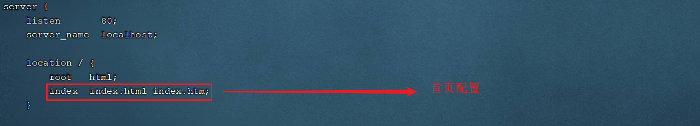 

如果我们需要将hello.html作为nginx的首页，可以修改location的index指令，配置为hello.html，如下：

 

配置完毕后，我们可以通过指令，来检查配置文件是否配置正确： nginx -t

 

配置文件修改了，我们需要重新加载一下，才可以生效： 

```
nginx -s reload
```

**4). 访问**

http://192.168.200.200 


###  反向代理

1). 正向代理

正向代理 是`客户端的代理`，帮助客户端访问其`无法访问`的服务器资源，例如一些国外网站

1. 正向代理服务器是一个位于客户端和服务器(origin server)之间的服务器
2. 客户端不能直接访问服务器，
3. 客户端向代理发送一个请求并指定目标服务器，
4. 代理向原始服务器转交请求并将获得的内容返回给客户端。

正向代理一般是**在客户端设置代理服务器**，通过代理服务器转发请求，**隐藏了客户端身份**最终访问到目标服务器。 

2). 反向代理

反向代理，是"代理服务器" 代理了"目标服务器"，**隐藏了服务器**去和"客户端"进行交互。

反向代理服务器位于用户与目标服务器之间，但是对于用户而言，反向代理服务器就相当于目标服务器，即用户直接访问反向代理服务器就可以获得目标服务器的资源，反向代理服务器负责将请求转发给目标服务器。用户不需要知道目标服务器的地址，也无须在用户端作任何设定，对于用户来说，访问反向代理服务器是完全无感知的。


反向代理的作用：

1. 隐藏服务器真实IP：客户端只知道代理服务器地址，可以对客户端隐藏服务器的IP地址。客户端同时也不用去记住所有服务器地址
2. 负载均衡：根据服务器的负载情况，将客户端请求分发到不同的真实服务器上。
3. 缓存服务：可以对于静态内容及短时间内有大量访问请求的动态内容提供缓存服务，提高访问速度。
4. 安全防护：反向代理服务器可以作为应用层防火墙，为网站提供对基于Web的攻击行为（例如DoS/DDoS）的防护，更容易排查恶意软件等。还可以提供HTTP访问认证等。


那么在本小节，我们就是要使用nginx来作为反向代理服务器使用。 在nginx中，我们可以在nginx.conf中配置反向代理: 


```yaml
server {
    listen 82; 	#监听端口
    server_name localhost; #服务器地址
    location /user {    
        proxy_pass http://192.168.56.102:8081; 	# 反向代理配置，将/user请求转发到指定服务
    }
    location /product {
        proxy_pass http://192.168.56.103:8082; 	#反向代理配置，将/product请求转发到指定服务
    }
}
```

上述配置的含义为: 当我们访问nginx的82端口时，根据反向代理配置

- 将 /user 开头的请求转发到 http://192.168.56.102:8081 服务上。
- 将 /product开头的请求转发到 http://192.168.56.103:8082 服务上。


#### 环境搭建

**项目部署:** 在 192.168.56.102 这台服务器中使用 user-1.0-SNAPSHOT.jar 部署项目

1. 安装jdk并配置环境变量
2. 上传 【资料】-【演示jar包】- user-1.0-SNAPSHOT.jar 到 /opt目录
3. 启动项目
4. 防火墙开放8081端口
5. 访问测试


第一步：安装jdk并配置环境变量

```
 # 上传jdk 到 /opt目录
 # 解压
 tar -zxvf jdk-8u171-linux-x64.tar.gz -C /usr/local/
 # 配置环境变量
 yum -y install vim
 vim /etc/profile
 
 # 添加如下2行
export JAVA_HOME=/usr/local/jdk1.8.0_171
export PATH=$PATH:$JAVA_HOME/bin

# 刷新配置
source /etc/profile
# 验证
java -version
```


第二步：上传项目

上传 【资料】-【演示jar包】- user-1.0-SNAPSHOT.jar 到 /opt目录


第三步：启动项目

```
cd /opt
nohup java -jar user-1.0-SNAPSHOT.jar &> user.log &
```


第四步：防火墙开放8081端口

```
firewall-cmd --add-port=8081/tcp --permanent
firewall-cmd --reload
```


第五步：访问测试

http://192.168.56.102:8081/user/

http://192.168.56.102:8081/user/hello


> 192.168.56.103 服务器上部署 product 项目，过程同上
>
> - product 项目端口是 8082
> - 访问路径： http://192.168.56.103:8082/product/list  http://192.168.56.103:8082/product/1

#### 配置反向代理

**1). 在192.168.56.101中的nginx.conf中配置反向代理**

进入nginx的安装目录，并编辑配置文件nginx.conf:

```
cd /usr/local/nginx/conf/
vim nginx.conf
```


在http块中,再添加一个server块虚拟主机的配置,监听82端口,并配置反向代理`proxy_pass`: 

语法格式： proxy_pass URL;

URL:为要设置的被代理服务器地址，包含传输协议(`http`,`https://`)、主机名称或IP地址加端口号、URI等要素。

```yaml
server {
    listen 82;
    server_name localhost;
    location /user {
        proxy_pass http://192.168.56.102:8081; 	#反向代理配置，将请求转发到指定服务
    }
    location /product {
        proxy_pass http://192.168.56.103:8082; 	#反向代理配置，将请求转发到指定服务
    }
}
```


**2). 检查配置文件，并重新加载**

```
nginx -t 
```

```
nginx -s reload
```

**3). 防火墙开放82端口**

```
firewall-cmd --add-port=8081/tcp --permanent
firewall-cmd --reload
```

#### 测试

访问测试：

- http://192.168.56.101:82/user

- http://192.168.56.101:82/user/hello

- http://192.168.56.101:82/product/1

- http://192.168.56.101:82/product/list

  

### 6.4 负载均衡

#### 6.4.1 概念介绍

随着互联网的发展，业务流量越来越大，单台服务器无法抗住所有请求，而且一旦出现故障，整个服务都不可用

因此需要多台服务器组成`应用集群`，进行性能的`水平扩展`以及避免单点故障出现。

此时就需要`负载均衡`，将用户请求根据对应的负载均衡算法，分发到应用集群中的某台服务器进行处理

#### 商品服务负载均衡

**1). 在56.102 与 56.103上 同时部署商品服务器 **

**2). 运行上传上来的jar包**

- 执行 nohup java -jar product-1.0-SNAPSHOT.jar &> product.log & 后台运行项目
- 防火墙开放 8082 端口

**3). 在nginx中配置负载均衡**

打开nginx的配置文件nginx.conf并增加如下配置: 

```yaml
	#upstream指令可以定义一组服务器( 名称不能包含 下划线_ )
	upstream products{
        server 192.168.56.102:8082;
        server 192.168.56.103:8082;
   }

    server{
        listen 82;
        server_name localhost;
 
        location /product {
		  # proxy_pass http://192.168.56.103:8083;  # 反向代理
           
           # 负载均衡 ,以products开头的请求转发到upstream指定的服务器上, 默认是轮询策略
           proxy_pass http://products; 
        }
    }
```


**4). 重新加载nginx配置文件,访问**

```shell
nginx -s reload
```

测试：访问5次商品服务，查看后台打印

http://192.168.56.101:82/product/5


#### 6.4.3 负载均衡策略

处理上述默认的轮询策略以外，在Nginx中还提供了其他的负载均衡策略，如下： 

| **名称**   | **说明**         | 特点                                                         |
| ---------- | ---------------- | ------------------------------------------------------------ |
| 轮询       | 默认方式         | 使用最多                                                     |
| weight     | 权重方式         | 根据权重分发请求,权重大的分配到请求的概率大<br />此策略比较适合服务器的硬件配置差别比较大的情况 |
| ip_hash    | 依据ip分配方式   | 根据客户端请求的==IP地址计算hash值==， ==根据hash值来分发请求==, 同一个IP发起的请求, 会发转发到同一个服务器上<br />ip_hash指令`无法保证后端服务器的负载均衡`，可能导致有些后端服务器接收到的请求多，有些后端服务器接收的请求少，而且设置后端服务器权重等方法将不起作用。 |
| least_conn | 依据最少连接方式 | 最少连接，把==请求转发给连接数较少的后端服务器==。轮询算法是把请求平均的转发给各个后端，使它们的负载大致相同；但是，有些请求占用的时间很长，会导致其所在的后端负载较高。这种情况下，least_conn这种方式就可以达到更好的负载均衡效果。<br />此负载均衡策略`适合请求处理时间长短不一`造成服务器过载的情况。 |
| url_hash   | 依据url分配方式  | 根据客户端请求url的hash值，来分发请求, 同一个url请求, 会发转发到同一个服务器上<br />一旦请求缓存了资源，再此收到请求，就可以从缓存中读取，提高缓存命中率 |
| fair       | 依据响应时间方式 | 优先把请求分发给处理请求时间短的服务器                       |


**权重的配置：** 

```properties
#upstream指令可以定义一组服务器
upstream products{
	server 192.168.56.102:8083 weight=10;
	server 192.168.56.103:8083 weight=5;
} 
```

上述配置的weight权重是相对的，在上述的配置中，效果就是，在大数据量的请求下，最终102接收的请求数是103的两倍。

**url_hash**

```properties
upstream products{
    # &request_uri nginx提供用于获取uri的变量
	hash &request_uri;
	server 192.168.56.102:8002;
	server 192.168.56.103:8083;
}
```

**Least connected**

```properties
upstream products{
	least_conn;
	server 192.168.56.102:8002;
	server 192.168.56.103:8083;
}
```


# Nacos

Windows安装

在Nacos的GitHub页面，提供有下载链接，可以下载编译好的Nacos服务端或者源代码：

GitHub主页：https://github.com/alibaba/nacos

GitHub的Release下载页：https://github.com/alibaba/nacos/releases

如图：


windows版本使用`nacos-server-1.4.1.zip`包即可。

将这个包解压到任意非中文目录下

目录说明：

- bin：启动脚本
- conf：配置文件

端口配置

Nacos的默认端口是8848，如果你电脑上的其它进程占用了8848端口，请先尝试关闭该进程。

**如果无法关闭占用8848端口的进程**，也可以进入nacos的conf目录，修改配置文件中的端口：

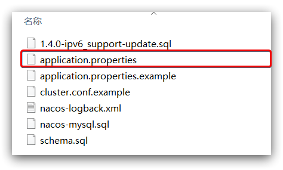

修改其中的内容：

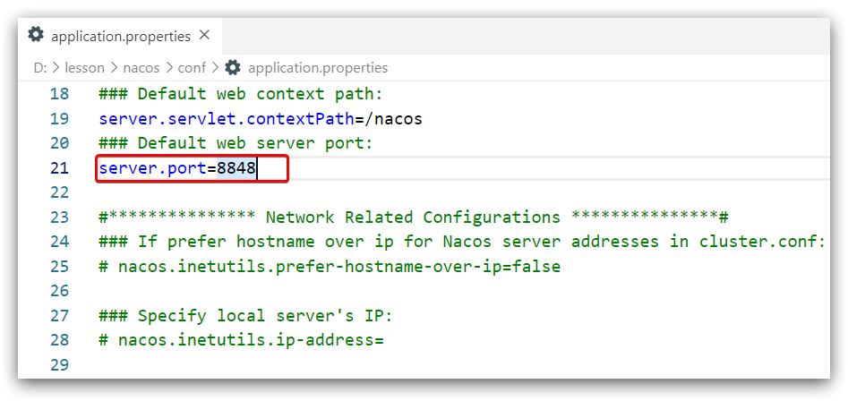


启动非常简单，进入bin目录，然后执行命令即可：

- windows命令：

  ```sh
  startup.cmd -m standalone
  ```


执行后的效果如图：


在浏览器输入地址：http://127.0.0.1:8848/nacos, 默认的账号和密码都是nacos


Linux或者Mac安装方式与Windows类似。

Nacos依赖于JDK运行，索引Linux上也需要安装JDK才行。

上传安装包, 到Linux服务器的某个目录，例如`/usr/local/src`目录下：


命令解压缩安装包：

```sh
tar -xvf nacos-server-1.4.1.tar.gz
```

然后删除安装包：

```sh
rm -rf nacos-server-1.4.1.tar.gz
```

目录内部：


端口配置与windows中类似

启动, 在nacos/bin目录中，输入命令启动Nacos：

```sh
sh startup.sh -m standalone
```


# Docker

###  安装docker

Docker可以运行在MAC、Windows、CentOS、UBUNTU等操作系统上，本课程基于==CentOS7== 安装Docker。官网：https://www.docker.com

```shell
# 1、yum 包更新到最新，更新yum源 
yum update
# 2、安装需要的软件包， yum-util 提供yum-config-manager功能，另外两个是devicemapper驱动依赖的 
yum install -y yum-utils device-mapper-persistent-data lvm2
# 3、 设置yum源
yum-config-manager --add-repo https://download.docker.com/linux/centos/docker-ce.repo
# 4、 安装docker，出现输入的界面都按 y 
yum install -y docker-ce
# 5、 查看docker版本，验证是否验证成功
docker -v
```

### 配置镜像加速

默认情况下，从docker hub（https://hub.docker.com/）上下载docker镜像，太慢。一般都会配置镜像加速器

**（1） 创建文件并配置**

在linux中自己创建：vi /etc/docker/daemon.json文件，并导入镜像地址（二选一）

如果不能用上述命令直接创建, 可以先创建文件夹 mkdir /etc/docker , 再用上述命令创建文件

```json
中科大镜像地址
{
 "registry-mirrors":["https://docker.mirrors.ustc.edu.cn"]
}
  阿里云镜像地址
{
  "registry-mirrors": ["https://x1am3gq3.mirror.aliyuncs.com"]
}
```

**（2） 重新启动docker**

```shell
systemctl restart docker #重启

docker info 			#查看docker信息
```


Docker命令

```bash
# ============ 系统相关
systemctl start docker 		#启动docker服务
systemctl stop docker 		#停止docker服务
systemctl restart docker	#重启docker服务
systemctl status docker 	#查看docker服务状态
systemctl enable docker		#设置开机启动docker服务

# ============ 镜像相关
docker images				 # 查看本地所有镜像
docker images –q 			  # 查看本地所有镜像的id
docker search 镜像名称		   # 搜索镜像:从网络中查找需要的镜像
# 如果版本号不指定则是最新的版本。如果不知道镜像版本，可以去 https://hub.docker.com 搜索查看。
docker pull 镜像名称:版本号 	 # 拉取镜像:从Docker仓库下载镜像到本地
docker rmi 镜像id 			# 删除指定本地镜像, 如果有多个id用空格分开
docker rmi `docker images -q`  # 删除所有本地镜像

# ============ 容器相关
docker ps 	 # 查看正在运行的容器
docker ps –a # 查看所有容器
# 创建并启动容器
docker run 参数
# 交互式(需要保持窗口) 创建容器：创建并启动容器，进入容器内部，通过exit退出容器（关闭容器） 
docker run -it --name=自定义容器名 镜像名:版本号 /bin/bash
# 守护式(后台运行) 创建容器：创建并后台启动容器，不会进入到容器内部
docker run -id --name=自定义容器名 镜像名:版本号 
docker exec -it 容器名称 /bin/bash # 进入守护式容器(通过exit退出容器后，容器不会关闭)
docker stop 容器名称	# 停止容器
docker start 容器名称	# 启动容器
docker rm 容器名称		# 删除容器
docker inspect 容器名称	 # 查看容器信息

```


### 配置数据卷

为了后续方便操作：关闭防火墙

systemctl stop firewalld # 关闭防火墙
systemctl restart docker # 防火墙和docker有关联，重启下docker

创建启动容器时，使用 –v 参数 设置数据卷

```shell
# 创建启动容器，挂载数据卷: docker run ... –v 宿主机目录(文件):容器内目录(文件) ... 
docker run -id --name=my_redis5 -v /root/data/:/usr/data/ redis:5.0
```


进入容器,查看共享文件


##  Redis部署

端口映射


1. 外部机器只能访问宿主机端口
2. 宿主机可以和容器内部的端口进行交互
3. 宿主机端口和容器的端口相互隔离
4. 容器之间的端口互相隔离
5. 容器内部的端口,程序员使用应用程序的默认端口


**需求：**在Docker容器中部署Redis（5.0版本），并通过外部机器访问Redis

**要求：**宿主机对外提供的端口  6378


**操作步骤：**	

```shell
# 启动容器，使用 -p 指定端口映射, 宿主机自己指定,不冲突即可, 容器端口保持程序默认
# docker run ... –p 宿主机端口:容器端口 ... 

docker run -id --name=my_redis -p 6378:6379  redis:5.0    
```


## tomcat部署

**需求：** 在Docker容器中部署Tomcat，并通过外部机器访问Tomcat部署的项目。


```shell
docker run -id --name=my_tomcat -v /dataLYY/webapps/:/usr/local/tomcat/webapps  -p 8080:8080 tomcat 
# /usr/local/tomcat/webapps, 容器中文件的位置不要乱写, 要根据官方指出的容器存放位置
```


## nginx部署

**需求：** 在Docker容器中部署Nginx，并通过外部机器访问Nginx。

需要挂载: 配置文件, 配置目录, 静态资源目录, 日志目录

```shell
# 在宿主机 /dataLYY目录下 创建3个目录用于挂载
mkdir -p /dataLYY/nginx/{conf,html,logs}

# 先运行一个nginx用于复制里面的文件
docker run -id --name=my_nginx -p 80:80 nginx

# 将容器内的nginx.conf 和 default.conf文件分别复制到主机 /dataLYY/nginx 和 /dataLYY/nginx/conf下
docker cp my_nginx:/etc/nginx/nginx.conf /dataLYY/nginx
docker cp my_nginx:/etc/nginx/conf.d/default.conf /dataLYY/nginx/conf

# 停止, 删除原容器
docker stop my_nginx
docker rm my_nginx

# 以上步骤是为了得到容器中的两个配置文件, 如果已有就不用操作上述步骤

# 守护运行, 并挂载 配置文件, 日志目录, 静态资源目录, 默认配置文件目录
docker run -id --name my_nginx -p 80:80
-v /dataLYY/nginx/nginx.conf:/etc/nginx/nginx.conf
-v /dataLYY/nginx/logs:/var/log/nginx
-v /dataLYY/nginx/html:/usr/share/nginx/html
-v /dataLYY/nginx/conf:/etc/nginx/conf.d
--privileged=true nginx
```

--privileged 参数:

- 使container内的root拥有真正的root权限，否则只是外部的一个普通用户权限
- 可以看到很多host上的设备，并且可以执行mount
- 允许你在docker容器中启动docker容器

操作步骤:


容器内nginx的重要目录

 

访问测试:

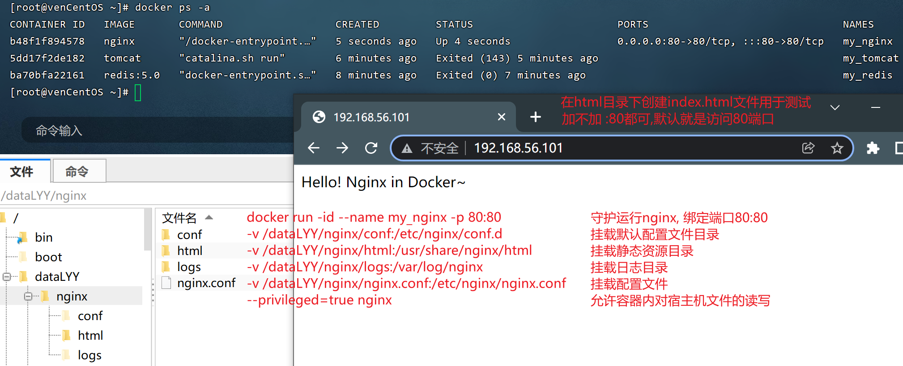


## mysql部署

**需求：**在Docker容器中部署MySQL，并通过外部mysql客户端操作MySQL Server。

容器中mysql：默认存储数据的文件夹位置  `/var/lib/mysql`

在容器创建的时候：可以指定mysql的密码,  -e MYSQL_ROOT_PASSWORD=123456


​    

```shell
# 之前在Linux安装的MySQL软件占用了3306端口, 所以这里需要把宿主机映射的端口改为3307
docker run -id --name=my_mysql -p 3307:3306 -v /dataLYY/mysql:/var/lib/mysql 
-e MYSQL_ROOT_PASSWORD=root  mysql:5.6
```

使用DataGrip测试: 


## Dockerfile

程序员自定义镜像（打包镜像）

**操作系统的组成部分**


**镜像原理**


CentOS7镜像200M: rootfs的200M

Tomcat镜像600M: JDK的560M + Tomcat的40M

dockerfile：自定义镜像。通过文件的形式配置应用以及应用所需要的环境。

通过命令执行文件：自动的将应用和环境打包为镜像


 案例

**需求：**定义dockerfile，发布springboot项目

资料中已经准备好了一个springboot程序的jar包 - app.jar, 该程序请求端口: 8080, 请求连接: /hello, 将此jar包打包成docker镜像

**实现步骤：**

(1) 编写dockerfile文件

```shell
#1.定义父镜像：
FROM java:8
#2.定义作者信息：
MAINTAINER  itheima <itheima@itcast.cn>
#3.将jar包添加到镜像： 
ADD app.jar app.jar
#4.定义容器启动执行的命令： 当通过此镜像启动容器的时候，执行的命令
CMD java -jar app.jar
```

(2) 上传jar包

(3) 通过dockerfile构建镜像

```shell
#通过dockerfile构建镜像：(注意末尾的‘.’, 代表当前路径)
docker build –f dockerfile文件路径 –t 镜像名称 . 
```

(4) 启动容器

```shell
#创建启动容器
docker run -id --name=自定义名称 -p 端口  镜像名称
```


Docker Compose是一个编排多容器分布式部署的工具，提供命令集管理容器化应用的完整开发周期，包括服务构建，启动和停止。使用步骤：

​	1.创建docker-compose.yml的配置文件

2. 使用 docker-compose.yml 定义组成应用的各服务
3. 运行 docker-compose up -d 启动应用

安装Docker Compose

```shell
# Compose目前已经完全支持Linux、Mac OS和Windows，在我们安装Compose之前，需要先安装Docker。下面我 们以编译好的二进制包方式安装在Linux系统中。 
curl -L https://github.com/docker/compose/releases/download/1.22.0/docker-compose-`uname -s`-`uname -m` -o /usr/local/bin/docker-compose
# 设置文件可执行权限 
chmod +x /usr/local/bin/docker-compose
# 查看版本信息 
docker-compose -version
```

卸载Docker Compose

```shell
# 二进制包方式安装的，删除二进制文件即可
rm /usr/local/bin/docker-compose
```

案例

需求：通过docker-compose 批量创建三个容器（nginx，tomcat，redis）

* 文件：docker-compose.yml，定义批量管理的容器
* 通过命令批量创建和启动：docker-componse up -d

（1） 创建docker-compose目录

```shell
mkdir ~/docker-compose
cd ~/docker-compose
```

（2） 编写docker-compose.yml 文件

```yaml
#批量创建 redis，nginx，tomcat
version: '3' # 版本
services:    # 配置管理的容器
  
  redis:
   container_name: my_redis2
   image: redis:5.0
   ports:
    - 6379:6379
    
  tomcat:                           # 唯一标志id
   container_name: my_tomcat2       # 容器名称    --name=my_tomcat
   image: tomcat                    # 镜像:版本(不写版本就用最新的)
   volumes:                         # 绑定数据卷(横杠- 表示数组)
    - /dataLYY/webapps/:/usr/local/tomcat/webapps
   ports:                           # 端口映射
    - 8080:8080
    
  nginx:
   container_name: my_nginx2
   image: nginx
   ports:
    - 80:80
   volumes:
    - /dataLYY/nginx/nginx.conf:/etc/nginx/nginx.conf
    - /dataLYY/nginx/logs:/var/log/nginx
    - /dataLYY/nginx/html:/usr/share/nginx/html
    - /dataLYY/nginx/conf:/etc/nginx/conf.d
    
  mysql:
   container_name: my_mysql2
   image: mysql:5.6
   ports:
    - 3307:3306
   volumes:
    - /dataLYY/mysql:/var/lib/mysql
   environment:
    MYSQL_ROOT_PASSWORD: root # 密码
    TZ: Asia/Shanghai         # 时区设置
```

（3） 启动容器

```shell
# 进入docker-compose.yml 文件所在目录下
docker-compose up -d   # 批量启动
docker-compose restart # 批量重启
docker-compose stop    # 批量停止
docker-compose rm      # 批量删除
```


# RabbitMQ

### 安装

RabbitMQ已经安装到docker中

```shell
# 拉取镜像
docker pull rabbitmq:management
# 创建容器并启动
docker run -id --name=rabbit --hostname=rabbit -p 15672:15672 -p 5672:5672 rabbitmq:management
```


> RabbitMQ启动成功后暴露两个端口
>
> java应用端连接：192.168.136.10:5672
>
> 管理后台地址：http://192.168.136.10:15672
>
> 管理员账号/密码  guest/guest

### 登录存在的问题

部分同学，启动rabbit容器之后，进入管理后台，用户名和密码不可用。由于docker的环境导致内部容器文件不可用, 解决办法: 停止删除,重新创建容器.

### 配置

和使用Mysql类似，Java代码操作时一般不会使用超级管理员账号

* 一个项目分配一个账号							
* 一个项目分配一个虚拟主机                        
* 分配此账号对此虚拟主机的操作权限    

**添加账号**


**添加虚拟主机**


**配置权限**


# ElasticSearch

### 安装ElasticSearch

> 目前我们安装的是ES的7.12.1版本，需要JDK1.8及以上
>
> ES, Kibana的路径必须是没中文没空格的目录

1. 解压资料中准备好的软件到一个 **没有中文没有空格** 的位置!

2. 修改config/elasticsearch.yml文件中索引数据和日志数据存储的路径 (编码必须是UTF-8)

    

3. 修改config/jvm.options文件中虚拟机内存

    

4. 进入bin目录中直接双击启动命令

    

5. 访问

   >服务器暴露两个端口:   9300( 集群节点间通讯接口，TCP协议 )    9200( rest访问接口，HTTP协议 )

   我们在浏览器中访问：http://localhost:9200，来测试是否启动成功

    

### head插件安装

>Head是一款用于查看ES数据库的浏览器插件，我们需要在Chrome浏览器中加载这个插件
>
>验证测试结果

1. 复制插件到本地电脑的一个位置

    

2. 从Chrome浏览器中导入这个插件

    

3. 使用插件查看ES数据

   

### kibana安装

>Kibana是一个ES索引库数据统计工具，可以利用ES的聚合功能，生成各种图表，如柱形图，线状图，饼图等。
>
>而且还提供了操作ES索引数据的控制台，并且提供了一定的API提示，非常有利于我们学习ES的语法。

1. 因为Kibana依赖于node，需要在windows下先安装Node.js，双击运行课前资料提供的node.js的安装包

     

2. 课程资料中提供了Kibana的安装包，解压到一个 **没有中文没有空格** 的位置

    

3. 修改config/kibana.yml文件

    

4. 运行bin目录，启动服务器

    

5. 通过浏览器访问http://localhost:5601

6. 选择左侧的DevTools菜单，即可进入控制台页面，输入请求，访问Elasticsearch了 


### IK分词器安装

> ES自带的分词器叫standard analyzer，它对中文支持是非常不友好的，会将每个汉字作为一个词，显然不符合汉语习惯

~~~json
GET  /_analyze
{
  "analyzer": "standard", 
  "text":     "我是中国人"
}
~~~

 

>此时就需要我们制定一款适合于中文分词习惯的分词器，业界比较优秀的是IK分词器，它有两种颗粒度的拆分：
>
>`ik_smart`: 会做粗粒度的拆分
>
>`ik_max_word`: 会将文本做最细粒度的拆分

1. 解压elasticsearch-analysis-ik-7.4.0.zip

   

2. 将解压后的文件夹拷贝到elasticsearch-7.12.1\plugins下，必须重命名文件夹为ik

   

3. 重新启动ElasticSearch和kibana，即可加载IK分词器

4. 重新测试

   ~~~json
   GET /_analyze
   {
     "analyzer": "ik_max_word",
     "text":     "我是中国人"
   } 
   ~~~


#### 扩展词词典

随着互联网的发展，“造词运动”也越发的频繁。出现了很多新的词语，在原有的词汇列表中并不存在。比如：“奥力给”，“传智播客” 等。

所以我们的词汇也需要不断的更新，IK分词器提供了扩展词汇的功能。

1）打开IK分词器config目录：


2）在IKAnalyzer.cfg.xml配置文件内容添加：

```xml
<?xml version="1.0" encoding="UTF-8"?>
<!DOCTYPE properties SYSTEM "http://java.sun.com/dtd/properties.dtd">
<properties>
        <comment>IK Analyzer 扩展配置</comment>
        <!--用户可以在这里配置自己的扩展字典 *** 添加扩展词典-->
        <entry key="ext_dict">ext.dic</entry>
</properties>
```

3）新建一个 ext.dic，可以参考config目录下复制一个配置文件进行修改

```properties
传智播客
奥力给
```

4）重启elasticsearch

5）测试效果：

```json
GET /_analyze
{
  "analyzer": "ik_max_word",
  "text": "传智播客Java就业超过90%,奥力给！"
}
```

> 注意当前文件的编码必须是 UTF-8 格式，严禁使用Windows记事本编辑

#### 停用词词典

在互联网项目中，在网络间传输的速度很快，所以很多语言是不允许在网络上传递的，如：关于宗教、政治等敏感词语，那么我们在搜索时也应该忽略当前词汇。

IK分词器也提供了强大的停用词功能，让我们在索引时就直接忽略当前的停用词汇表中的内容。

1）IKAnalyzer.cfg.xml配置文件内容添加：

```xml
<?xml version="1.0" encoding="UTF-8"?>
<!DOCTYPE properties SYSTEM "http://java.sun.com/dtd/properties.dtd">
<properties>
        <comment>IK Analyzer 扩展配置</comment>
        <!--用户可以在这里配置自己的扩展字典-->
        <entry key="ext_dict">ext.dic</entry>
         <!--用户可以在这里配置自己的扩展停止词字典  *** 添加停用词词典-->
        <entry key="ext_stopwords">stopword.dic</entry>
</properties>
```

3）在 stopword.dic 添加停用词

```properties
习大大
```

4）重启elasticsearch 

5）测试效果：

```json
GET /_analyze
{
  "analyzer": "ik_max_word",
  "text": "传智播客Java就业率超过95%,习大大都点赞,奥力给！"
}
```

> 注意当前文件的编码必须是 UTF-8 格式，严禁使用Windows记事本编辑


# Seata

部署TC服务, 首先我们要下载seata-server包，地址在[http](http://seata.io/zh-cn/blog/download.html)[://seata.io/zh-cn/blog/download](http://seata.io/zh-cn/blog/download.html)[.](http://seata.io/zh-cn/blog/download.html)[html](http://seata.io/zh-cn/blog/download.html) 

修改配置, 修改conf目录下的registry.conf文件：


内容如下：

```properties
# 注册中心
registry {
  # tc服务的注册中心类型，这里选择nacos，也可以是eureka、zookeeper等
  type = "nacos"

  nacos {
  	# seata tc 服务注册到 nacos的服务名称，可以自定义
    application = "seata-tc-server"
    serverAddr = "127.0.0.1:8848"
    # 分组名,可自定义
    group = "SEATA_GROUP"
    # 命名空间,不写就是默认的 public
    namespace = ""
    # 集群名称
    cluster = "default"
    username = "nacos"
    password = "nacos"
  }
}

# 配置中心
config {
  # 读取tc服务端的配置文件的方式，这里是从nacos配置中心读取，这样如果tc是集群，可以共享配置
  type = "nacos"
  # 配置nacos地址等信息
  nacos {
    serverAddr = "127.0.0.1:8848"
    namespace = ""
    # 与新建配置的Group要一致
    group = "SEATA_GROUP"
    username = "nacos"
    password = "nacos"
    # 配置中心的Data Id
    dataId = "seataServer.properties"
  }
}
```

在nacos添加配置, 特别注意，为了让tc服务的集群可以共享配置，我们选择了nacos作为统一配置中心。因此服务端配置文件seataServer.properties文件需要在nacos中配好。格式如下：


配置内容如下：==其中只需要修改4项: 数据库, 数据库地址、用户名、密码==

```properties
# 数据存储方式, db表示数据库
store.mode=db
store.db.datasource=druid
store.db.dbType=mysql
store.db.driverClassName=com.mysql.jdbc.Driver
store.db.url=jdbc:mysql://127.0.0.1:3306/seata-server?useUnicode=true&rewriteBatchedStatements=true
store.db.user=root
store.db.password=root
store.db.minConn=5
store.db.maxConn=30
store.db.globalTable=global_table
store.db.branchTable=branch_table
store.db.queryLimit=100
store.db.lockTable=lock_table
store.db.maxWait=5000
# 事务、日志等配置
server.recovery.committingRetryPeriod=1000
server.recovery.asynCommittingRetryPeriod=1000
server.recovery.rollbackingRetryPeriod=1000
server.recovery.timeoutRetryPeriod=1000
server.maxCommitRetryTimeout=-1
server.maxRollbackRetryTimeout=-1
server.rollbackRetryTimeoutUnlockEnable=false
server.undo.logSaveDays=7
server.undo.logDeletePeriod=86400000

# 客户端与服务端传输方式
transport.serialization=seata
transport.compressor=none
# 关闭metrics功能，提高性能
metrics.enabled=false
metrics.registryType=compact
metrics.exporterList=prometheus
metrics.exporterPrometheusPort=9898
```

创建数据库表, 特别注意：tc服务在管理分布式事务时，需要记录事务相关数据到数据库中，你需要提前创建好这些表。

新建一个名为seata-server的数据库 

这些表主要记录全局事务、分支事务、全局锁信息：

```mysql
/*
 Navicat Premium Data Transfer

 Source Server         : local
 Source Server Type    : MySQL
 Source Server Version : 50622
 Source Host           : localhost:3306
 Source Schema         : seata_demo

 Target Server Type    : MySQL
 Target Server Version : 50622
 File Encoding         : 65001

 Date: 20/06/2021 12:38:37
*/

SET NAMES utf8mb4;
SET FOREIGN_KEY_CHECKS = 0;

-- ----------------------------
-- Table structure for branch_table
-- ----------------------------
DROP TABLE IF EXISTS `branch_table`;
CREATE TABLE `branch_table`  (
  `branch_id` bigint(20) NOT NULL,
  `xid` varchar(128) CHARACTER SET utf8 COLLATE utf8_general_ci NOT NULL,
  `transaction_id` bigint(20) NULL DEFAULT NULL,
  `resource_group_id` varchar(32) CHARACTER SET utf8 COLLATE utf8_general_ci NULL DEFAULT NULL,
  `resource_id` varchar(256) CHARACTER SET utf8 COLLATE utf8_general_ci NULL DEFAULT NULL,
  `branch_type` varchar(8) CHARACTER SET utf8 COLLATE utf8_general_ci NULL DEFAULT NULL,
  `status` tinyint(4) NULL DEFAULT NULL,
  `client_id` varchar(64) CHARACTER SET utf8 COLLATE utf8_general_ci NULL DEFAULT NULL,
  `application_data` varchar(2000) CHARACTER SET utf8 COLLATE utf8_general_ci NULL DEFAULT NULL,
  `gmt_create` datetime(6) NULL DEFAULT NULL,
  `gmt_modified` datetime(6) NULL DEFAULT NULL,
  PRIMARY KEY (`branch_id`) USING BTREE,
  INDEX `idx_xid`(`xid`) USING BTREE
) ENGINE = InnoDB CHARACTER SET = utf8 COLLATE = utf8_general_ci ROW_FORMAT = Compact;

-- ----------------------------
-- Records of branch_table
-- ----------------------------

-- ----------------------------
-- Table structure for global_table
-- ----------------------------
DROP TABLE IF EXISTS `global_table`;
CREATE TABLE `global_table`  (
  `xid` varchar(128) CHARACTER SET utf8 COLLATE utf8_general_ci NOT NULL,
  `transaction_id` bigint(20) NULL DEFAULT NULL,
  `status` tinyint(4) NOT NULL,
  `application_id` varchar(32) CHARACTER SET utf8 COLLATE utf8_general_ci NULL DEFAULT NULL,
  `transaction_service_group` varchar(32) CHARACTER SET utf8 COLLATE utf8_general_ci NULL DEFAULT NULL,
  `transaction_name` varchar(128) CHARACTER SET utf8 COLLATE utf8_general_ci NULL DEFAULT NULL,
  `timeout` int(11) NULL DEFAULT NULL,
  `begin_time` bigint(20) NULL DEFAULT NULL,
  `application_data` varchar(2000) CHARACTER SET utf8 COLLATE utf8_general_ci NULL DEFAULT NULL,
  `gmt_create` datetime NULL DEFAULT NULL,
  `gmt_modified` datetime NULL DEFAULT NULL,
  PRIMARY KEY (`xid`) USING BTREE,
  INDEX `idx_gmt_modified_status`(`gmt_modified`, `status`) USING BTREE,
  INDEX `idx_transaction_id`(`transaction_id`) USING BTREE
) ENGINE = InnoDB CHARACTER SET = utf8 COLLATE = utf8_general_ci ROW_FORMAT = Compact;

-- ----------------------------
-- Records of global_table
-- ----------------------------

-- ----------------------------
-- Table structure for lock_table
-- ----------------------------
DROP TABLE IF EXISTS `lock_table`;
CREATE TABLE `lock_table`  (
  `row_key` varchar(128) CHARACTER SET utf8 COLLATE utf8_general_ci NOT NULL,
  `xid` varchar(96) CHARACTER SET utf8 COLLATE utf8_general_ci NULL DEFAULT NULL,
  `transaction_id` bigint(20) NULL DEFAULT NULL,
  `branch_id` bigint(20) NOT NULL,
  `resource_id` varchar(256) CHARACTER SET utf8 COLLATE utf8_general_ci NULL DEFAULT NULL,
  `table_name` varchar(32) CHARACTER SET utf8 COLLATE utf8_general_ci NULL DEFAULT NULL,
  `pk` varchar(36) CHARACTER SET utf8 COLLATE utf8_general_ci NULL DEFAULT NULL,
  `gmt_create` datetime NULL DEFAULT NULL,
  `gmt_modified` datetime NULL DEFAULT NULL,
  PRIMARY KEY (`row_key`) USING BTREE,
  INDEX `idx_branch_id`(`branch_id`) USING BTREE
) ENGINE = InnoDB CHARACTER SET = utf8 COLLATE = utf8_general_ci ROW_FORMAT = Compact;

-- ----------------------------
-- Records of lock_table
-- ----------------------------

SET FOREIGN_KEY_CHECKS = 1;

```

启动TC服务

进入bin目录，运行其中的seata-server.bat即可：

启动成功后，seata-server应该已经注册到nacos注册中心了。

打开浏览器，访问nacos地址：http://localhost:8848，然后进入服务列表页面，可以看到seata-tc-server的信息

